Level 2 Challenges

# Level 2 Challenges

The challenges below are listed in alphabetical order, not necessarily the order they were completed.

## Admin Section

### Description:

Access the administration section of the store.

### Exploitation:

After completing the Login Admin challenge below, I started hunting for the admin section of the site.

Searching through the source led me to the path 'administration'

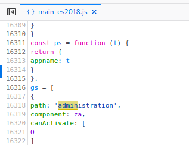

To access this part of the site I needed to be logged into the Admin account.

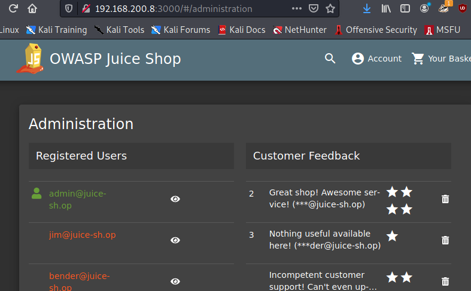

Accessing this administration interface completed the challenge.

## Deprecated Interface

### Description:

Use a deprecated B2B interface that was not properly shut down.

### Exploitation:

First I started looking around the code, and found a comment reference for B2B and invoice uploading.

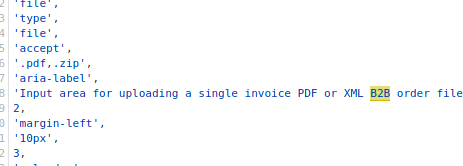

Clicking around the site a bit, I found an 'Invoice' upload in the complaint section, which seems to be out of place.

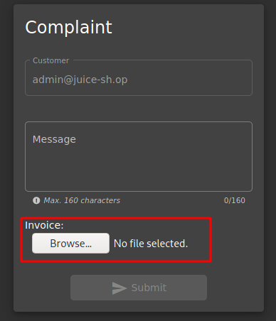

Uploading a file here completed the challenge.

## Five-Star Feedback

### Description:

Get rid of all 5-star customer feedback.

### Exploitation:

This was quite straight forward, in the administration section we accessed above, we can see the customer feedback. There is (was) only 1 5-star rating, I deleted using the rubbish bin icon it and that completed the challenge. I forgot to take a screen grab before deleting, but here is the feedback list without any 5-star ratings.

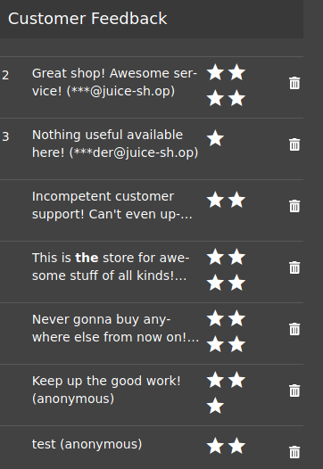

## Login Admin

### Description:

Log in with the administrator's user account.

### Exploitation:

In this challenge, having previously gone through the site, I noticed that the admin account had left reviews on some of the products. From this we have the admin's login email as below.

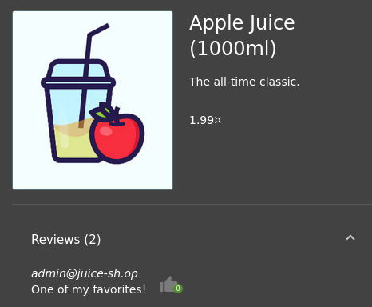

Then I referred back to one of the challenges in Level 1 where we received a SQL error in the code after entering in a single quote in the email section of the login page. Here is the error.

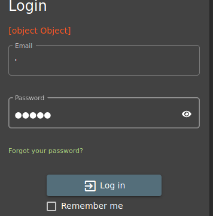

Looking at what Burp Suite captured, we can see the SQL error and the code used to check credentials. This can easily be bypassed.

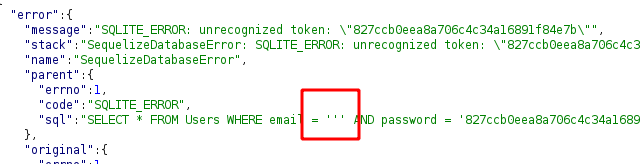

Here we can see the vulnerable code, the singled quote was put right into the SQL query.

So now to make the payload.

I'll use `admin@juice-sh.op'; --`

This should look up that account in the database, and comment out the password check part of the query.

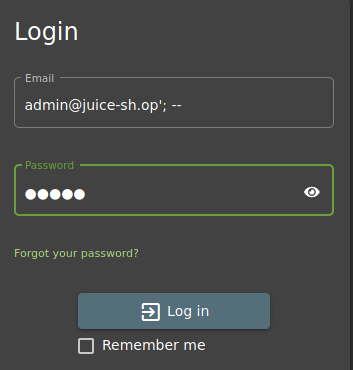

I put in a dummy password, and clicked login. 

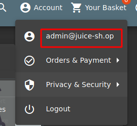

And we're in!

## Login MC SafeSearch 

### Description:

Log in with MC SafeSearch's original user credentials without applying SQL Injection or any other bypass.

### Exploitation:

In the administration section of the web-site we can see MC SafeSearch's email login.

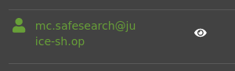

Googling MC SafeSearch comes up with an interesting music video about passwords and security. During the video the rapper states that his password is Mr Noodles, but he changed the o's to 0's so it's secure.

After trying a few different variations of the password to login we end up with `Mr. N00dles` as the login.

Now we're logged in as MC SafeSearch!

## Meta Geo Stalking

### Description:

Determine the answer to John's security question by looking at an upload of him to the Photo Wall and use it to reset his password via the Forgot Password mechanism.

### Exploitation:

Looking through the user list from when we logged into the administration section we can see a username john@juice-sh.op.

Then going to the forgotten password section will show the security question only after a valid user account has been typed in the email field. (This could be useful for user account enumeration!)

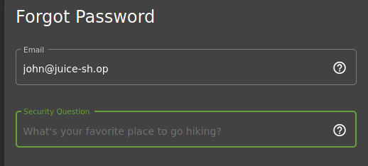

We can see the security questions is about John's favourite hiking location.

Navigating to the photo wall we can see a photo uploaded by 'johnny', I am assuming this is John's picture.

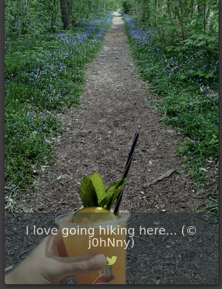

Next I downloaded the image from the site and used an online tool to view the geo tag info. There are plenty of sites that do it easily.

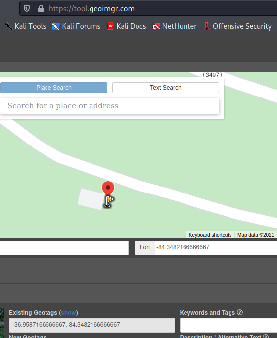

Now I'll copy the long / lat details and paste to google maps to see what that area is called.

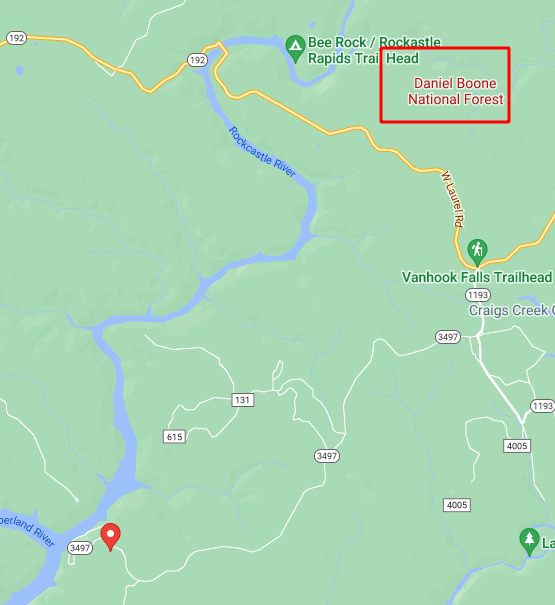

After trying a few trail names and forest names around the area, it turns out Daniel Boon National Forest is the answer, pasting that in the security question below allowed me to reset the password.

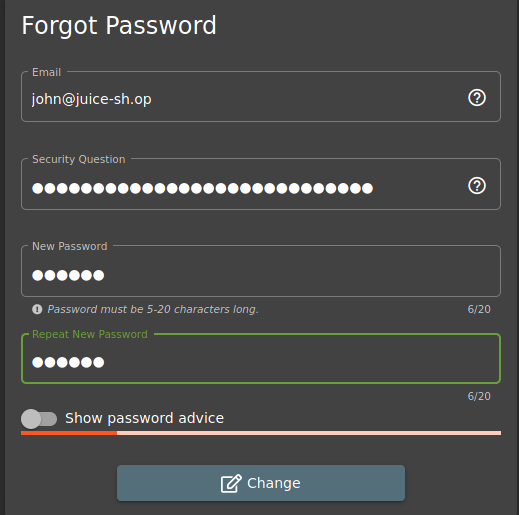

And now we have John's account!

## Password Strength

### Description:

Log in with the administrator's user credentials without previously changing them or applying SQL Injection.

### Exploitation:

This challenge implies that the password is weak, so I'll try a brute force attack on the account login page. Since Burp Suite Community is throttled, I'll use OWASP ZAP for this part.

With ZAP setup and proxying my browser, I'll first capture a login request.

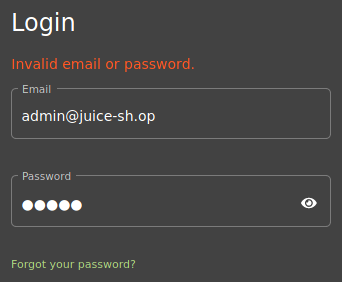

Here is the request:

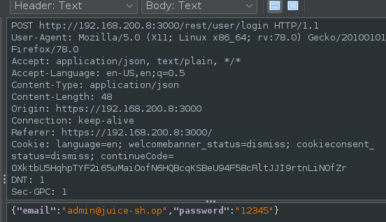

And the response from the server

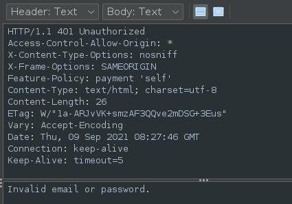

I'll send this over to the Fuzzer and load my default password list in Kali (rockyou.txt).

Now we have our fuzzer setup with the password list attacking the password field.

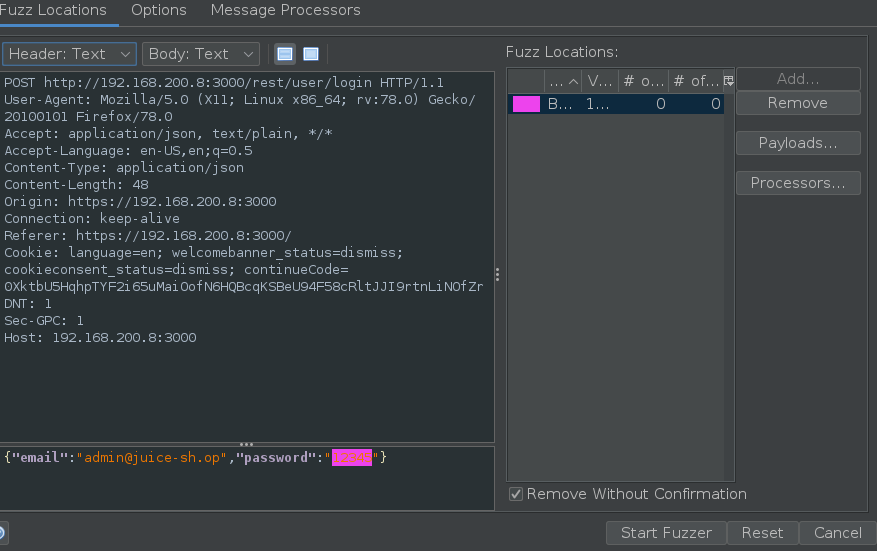

I'll kick it off and go have a coffee!

Coming back after a short while, I sorted the responses by size and found something interesting ;)

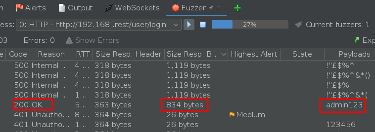

There we have it, logging in with admin123 as the password completed this challenge.

## Security Policy

### Description:

Behave like any "white-hat" should before getting into the action.

### Exploitation:

This description was not very helpful, it turns out that it is referring to securitytxt.org which was a hit provided in the course.

This site suggests using a file in the site called .well-known/security.txt as the contact information for site administrator to report any discovered vulnerabilities.

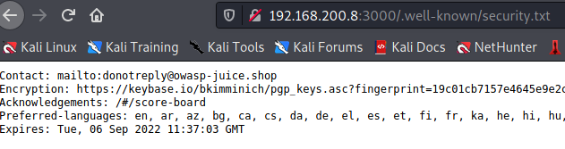

Navigating to this file completed the challenge.

## View Basket

### Description:

View another user's shopping basket.

### Exploitation:

In this exploit we want to login and view another user's shopping basket. There are two ways that this can be done. Using Burp suite and changing the GET request, or changing the local session data in our browser.

First I'll go through the Burp Suite method.

I'll login with an account we exploited Emma (see below for exploit).

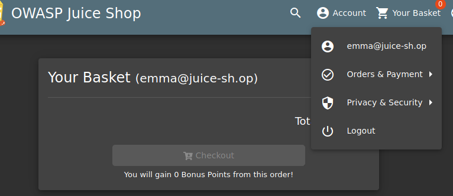

We can see she has nothing in her basket.

Having a look through what Burp captured when navigating to the basket I can see an associated ID for Emma. Basket 8.

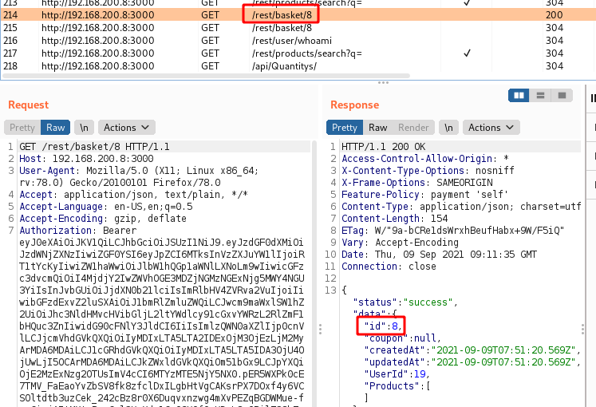

So I'll navigate to the basket again, and Intercept the request with Burp.

Below we can see the GET request.

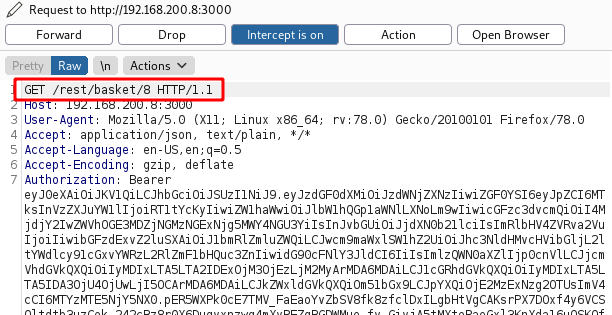

I change the basket number in the GET request above, in this case I changed it to 1.

Now we can see some items in the basket, indicating that it is not ours. The items belong to whoever owns basket 1. 

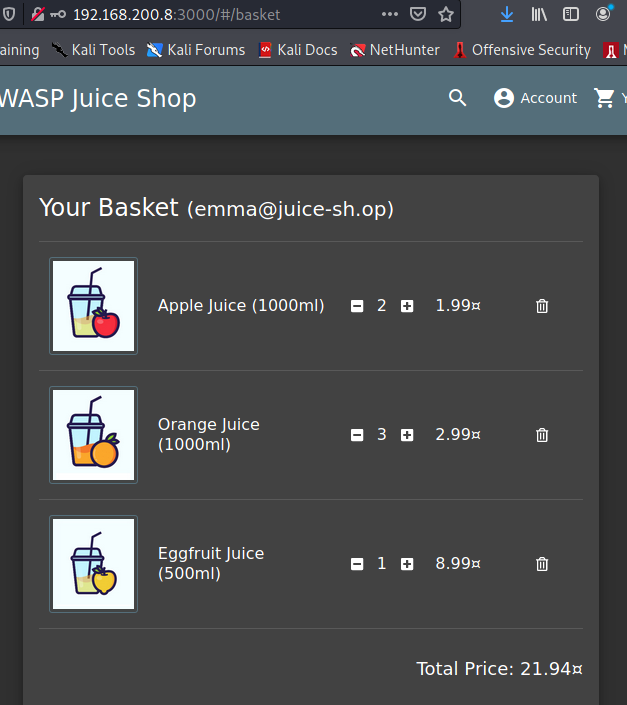

The other method this could be achieved is using the browser inspector and changing the local session information.

Using the inspect feature in my browser I navigate to storage and session storage information.

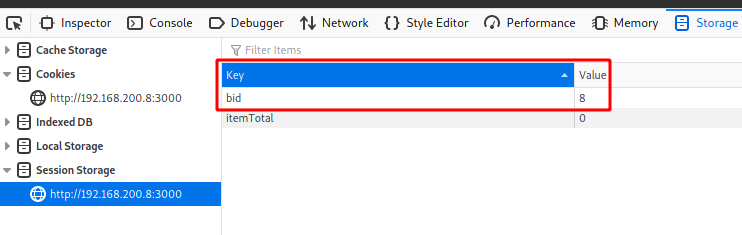

Here I can change the 'bid' value (i assume this stands for basket id).

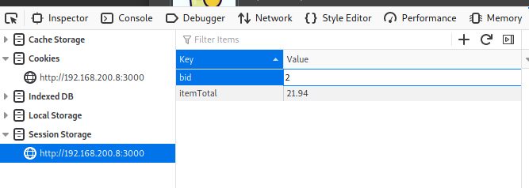

This time I changed it to a value of 2.

After refreshing my page, we can see another basket here.

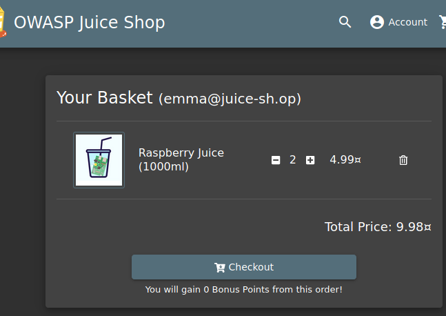

Accessing the baskets either way completed the challenge.

## Visual Geo Stalking

### Description:

Determine the answer to Emma's security question by looking at an upload of her to the Photo Wall and use it to reset her password via the Forgot Password mechanism.

### Exploitation:

My assumption will be that Emma's account is emma@juice-sh.op. we can verify this in the Forgot Password section, if we see the security question when entering in the email address.

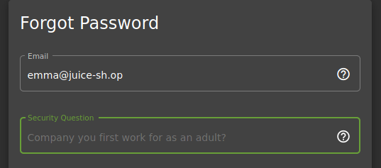

Here we can confirm that Emma's login is as I assumed above, and her question is about the first place she worked at.

Now we'll have a look at the photo wall as per the challenge description.

Here we can see an upload but Emma showing us her old workplace.

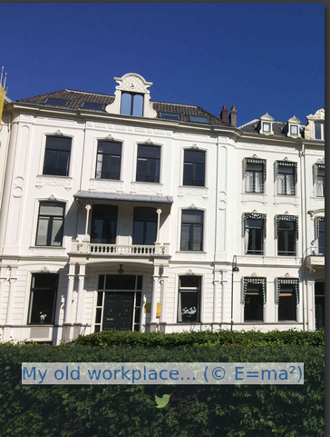

Let's download this image and see if we can see a geo tag or anything up close in the image (since it is a 'visual' geo stalk challenge).

No geotag was on the image.

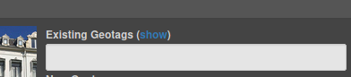

The only writing I could make out on the image is here:

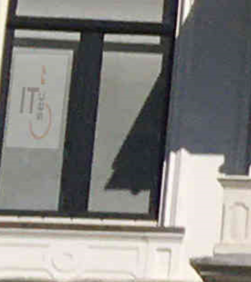

Seems to say ITsec, so I'll try that and some variations of it.

Well that worked on my first go, 'ITsec'

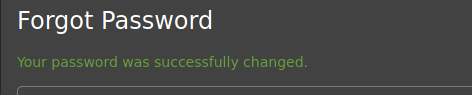

Now we have Emma's account.

## Weird Crypto 

### Description:

Inform the shop about an algorithm or library it should definitely not use the way it does.

### Exploitation:

Reading through this article about cryptography: https://wiki.owasp.org/index.php/Guide\_to\_Cryptography#Cryptographic_Algorithms 

There is a section outlining the vulnerable algorithms. MD5 being the first on the list.

Reviewing the previous server error we received when performing SQL injection, we can see the password hash in the error.

Here is a snippet from the error:

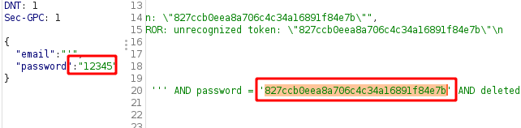

I looked this hash up in an online hash identifier tool. One of the possible types was MD5.

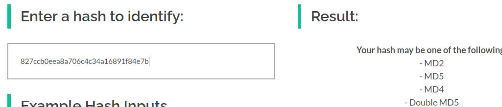

I then verified this using an MD5 decoder, and it decoded to the correct password - confirming that MD5 hashing is being used which is insecure.

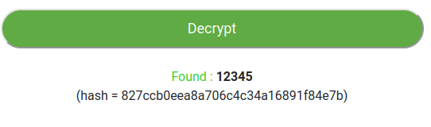

Entering MD5 into the customer feedback form completed this challenge.

Note there is one more XSS challenge but it is not avaialble on my Docker version of Juice Shop, so I'll add that at a later date when I have a chance to make another instance of Juice Shop.

That's all for this level!