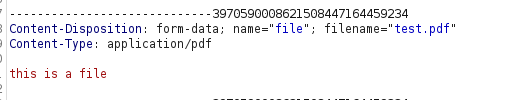
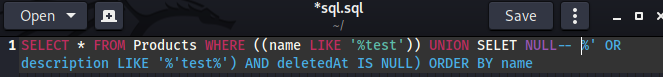

# Level 3 Challenges

The challenges below are not listed in any particular order, this list includes most of the Level 3 challenges.

## Admin Registration

### Description:

Register as a user with administrator privileges.

### Exploit:

Here we will register a user as an admin.

After registering a user, we can see the API section in burp.

We can see the API request and response here:

In particular the 'role' field looks interesting. We'll send this request over to Repeater and resubmit it to register a new user, but this time I'll add in the 'role' field manually in burp.

Here is my request and response, we can see the site has accepted my new account as an admin.

This has completed the challenge, we can see my new testadmin account has access to the administration console.

## Captcha Bypass

### Description:

Submit 10 or more customer feedbacks within 10 seconds.

### Exploit:

First we'll submit a review and capture it in our Burp proxy

We can see that in request includes the solved captcha and a captcha id.

I'll assume that the ID is related to the response. Se we can send this to the Intruder and try submit multiple reviews in a short period. I'll use a simple number based payload and see if we can submit multiple reviews quickly.

We can see this has worked, submitting several reviews re-using the captcha ID and response.

## Basket Manipulation

### Description:

Put an additional product into another user's shopping basket.

### Exploit:

First I'll add something to my basket, and capture the request in burp.

Here is the relevant request with the details about the product.

Note it includes the basket ID in the request.

If we change the BasketID and send the request, we receive an error.

So if we try to add another field in our request of BasketID to reset the basket ID we'll see what happens.

This worked we have managed to bypass the basket check.

Submitting this request solved the challenge!

## Payback time

### Description:

Place an order that makes you rich.

### Exploit:

Here I will attempt to add a negative qty of items to my basket.

The interface doesn't allow us to reduce items to a negative number, but I'll make a change to the qty and capture it in Burp.

Here is the relevant request.

I'll send this over to repeater and send some negative numbers!

It has accepted the negative number.

Now I'll try some larger ones!

Again it has accepted it, I used -300. And It also shows us in our basket that our order is a negative $ amount!

After adding some larger amounts, and checking out my wallet balance has increased!

This completed the challenge.

## Forged Review

### Description:

Post a product review as another user or edit any user's existing review.

### Exploit:

First we'll post some feedback to a product, capture the request and see what information is in the request.

Capturing the request, we can see that it includes an 'author' field.

I'll change this to admin@juice-sh.op and send it off to see what happens.

That did it, we posted a review as another user. This solved the challenge.

## Forged Feedback

### Description:

Post some feedback in another users name.

### Exploit:

We'll go over the customer feedback and submit a feedback form, capturing it in burp.

Submitting a feedback form and capturing it in burp gives us the following

The UserId looks interesting. I'll change this, submit it and see what happens.

Submitting this with UserID 1 solved the challenge.

## Upload Size

### Description:

Upload a file larger than 100 kB.

### Exploit:

If we try to upload a file in the complaint section, larger than 100kg, we receive an error.

I'll try and submit a file, then capture it in Burp to see what we get.

Choosing a smaller file and capturing it in burp gave me this:

I'll see if I can add more content to the data component where it says 'this is a file'.

I've send the request over to repeater, pasted in a large pdf file.

Then we submit and that will allow us to upload the content exceeding 100kb!

This solved the challenge! A note to self, using the repeater here is a must as it automatically updates the content-length field of the request. Otherwise it is not accepted properly by the server.

## Upload Type

### Description:

Upload a file that has no .pdf or .zip extension.

### Exploit:

This was a very similar process to the above exploit (upload size).

The only difference is changing the file extension in the request here:

Changing this pdf extension from pdf to any other file (other than zip) solves the challenge.

## Login Bender & Jim & Chris

This is actually three separate challenges, but the answer is the same, so I'll only write up once. Note for Chris's login you need to find his email in one of the product reviews or through a SQL injection query to the DB (more on that in an answer below).

### Description:

Log in with Bender's (and Jim's) user account.

### Exploit:

I'll use the same strategy as I used to login to the admin account.

Start off with SQL Injection:

This is my payload and I'll enter in a dummy password.

That did it!

Challenges solved.

## CSRF

### Description:

Change the name of a user by performing Cross-Site Request Forgery from [another origin](http://htmledit.squarefree.com).

### **Exploit:**

First I'll look at the source code on the page that sets the user name field.

We can see the interesting parts here

Using the link in the description I'll create a quick form.

I've setup the above form to post to my local JuiceShop with the relevant fields name and email.

We get a warning in Firefox, but click proceed and there we have it

This completes the challenge.

## Database Schema

### Description:

Exfiltrate the entire DB schema definition via SQL Injection.

### Exploit:

We know that the search field is susceptible to injection from previous challenges.

Attacking this field in Burp repeater provides us with some useful error information.

We can see in the error code that it is a SQLite DB.

We can see the query that we need to inject into here

First I'll use a UNION to try and determine how many fields there are being pulled through. Based off a previous query I'd guess 9, as the results of a successful query get me 9 fields. But I'll confirm this.

I'll use a text editor to start building queries

Here I am trying to determine the number of fields in the query with a UNION.

This gave me an error advising there is more than one field. I'll try 9 now.

When I put in 9x NULL it gives me a different error as apposed to 8 or 10.

This is because SQLite probably doesn't use NULL, but for this purpose we now know how many fields there are.

Quick research advises that the SQLite schema is in a table called sqlite_master with 'name' as the column names. I'll query this using numbers instead of NULL above.

Here is the query I will use:

`test'))%20UNION%20SELECT%20name,'1','1','2','3','4','5','6','7'%20FROM%20sqlite_master--`

Which gives us the details of the table names:

Now if I query for the 'sql' field I can get the table creation commands which gives us the full structure of all the tables, how they were created etc.

This might be useful later! From here we could pretty much query any of the tables to extract information.

We could get the above information in one combined query:

`test'))%20UNION%20SELECT%20sql,name,'1','2','3','4','5','6','7'%20FROM%20sqlite_master--`

This completed the challenge.

### Note:

That's it for now, there are a few more challenges in this category, some a just OSINT on user's security questions and a few that are unavailable in my Docker version of Juice Shop. So I'll come back to those at a later date, as my priority is finishing the training material on the Web Application Hacking course first.