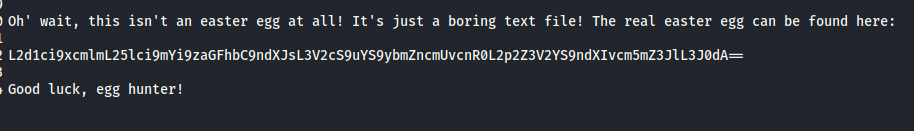

# Level 4 Challenges

The challenges below are not listed in any particular order. This list currently only covers some of the level 4 challenges.

## Christmas Special

### Description:

Order the Christmas special offer of 2014.

### Exploit:

Using the SQL injection flaw we identified previously on the search bar.

I'll first get a search captured in Burp and send it over to repeater, then generate our SQL error with an injection of test'

Here is the relevant part of our query, it checks for 'deletedAt', meaning that an item which is deleted is likely still in the DB just flagged as deleted.

So if I just comment out the rest of the query we should be able to get a list of all items in the search results, deleted or not.

Here is my query and we can see deleted items are showing.

Here we can see the item ID of the Christmas special

I'll try add it to my basket using Burp to intercept a query to add an item to the basket.

Here we can see a productID in the request

I'll send this to repeater and change it to 10.

And here we have it, the item is added to my basket.

Completing the order process completed this challenge.

## User Credentials

### Description:

Retrieve a list of all user credentials via SQL Injection.

### Exploit:

Referring back to level 3 where we got the DB schema, we're going to use the same process to dump the 'Users' table which we identified in that challenge.

Referring to the sql_master sql entries which define how the tables were created, we can see all the names of the columns in the table. Below is some of the output for the users table. Scrolling across we can see all the column names.

Here is the query we will use, getting the information from the table details above, and using the 9 columns in the UNION which we discovered in our previous challenge.

`test'))%20UNION%20SELECT%20id,username,email,password,role,deluxeToken,totpSecret,isActive,'7'%20FROM%20Users--`

Injecting this into the search field 'q' we get the following:

We can see lots of information here:

We also know that they're using MD5 hashes, as per the previous challenge in level 2. So we could easily decode all these passwords.

Running the query above completed this challenge.

## Forgotten Developers Backup

### Description:

Access a developer's forgotten backup file.

### Exploit:

Heading over to the FTP site we discovered earlier

We can see some backups here:

Attempting to download them directly yields an error - only md or pdf files allowed.

If we insert the 'poison null byte' into the URL with a suffix of .md we get the download prompt

That solves the challenge! This actually solves another challenge in the list called 'Poison Null Byte'.

## Hidden Easter Egg & Nested Easter Egg

I'll combine these two challenges into one.

### Description:

Find the hidden easter egg.

Apply some advanced cryptanalysis to find *the real* easter egg.

### Exploit:

First we download the eastere.gg file from the FTP site just like the last challenge (see above).

Opening the file we get this:

So we've located the hidden easter egg, now to find out the nested one.

This looks like BASE64 encoding, I'll use Burp to decode it.

After BASE64 decoding we get something that looks like a URL / Path

It turns out this is ROT13, using an online decoder we get the following:

Now to browse to that url path:

And out Easter egg is the earth. Browsing here completed the challenge.

### Note:

That's it for now. That concludes the Beginners Web Application Hacking course.

There are more challenges in this category so I'll come back to those at a later date. My priority at the moment is finishing the other training material I've outlined in this repo first.