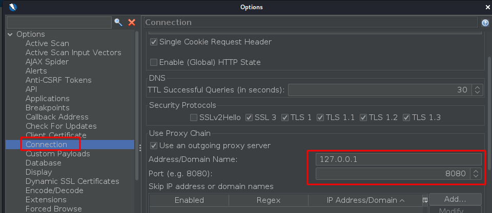

Readme

# Beginner Web Application Hacking - YouTube Course

## Summary

In this section I'll be taking the online course by The Cyber Mentor.

https://www.youtube.com/watch?v=24fHLWXGS-M&ab_channel=TheCyberMentor

This course was a great over view of the OWASP Top 10 using Juice Shop as a target website.

In my lab I setup Juice Shop on an Ubuntu server, using the Docker installation guide from their github page here: https://github.com/bkimminich/juice-shop

## Links

Here I will list the links to my write-ups for each challenge, dividing them into the difficulty level as defined on the Juice Shop score board.

- [Level 1 - Write-ups](Level%201%20Challenges.md)
- [Level 2 - Write-ups](Level%202%20Challenges.md)
- [Level 3 - Write-ups](Level%203%20Challenges.md)
- [Level 4 - Write-ups](Level%204%20Challenges.md)

That's it for this training course! 

The JuiceShop does have more challenges that the course does not cover, the course Author was explaining that the remaining challenges are not necessarily realistic - more like puzzles etc. But I plan to return to them after completing the other OWASP Top 10 training courses I'm covering in this repo.

## Tools

The main tools used throughout this course are all on Kali Linux. The course discusses some enumeration tools, but I won't list them here as they're not relevant to the Juice Shop challenges.

The course focuses on Burp Suite, however I used OWASP ZAP when more practical. The Burp Suite Community edition no longer allows for spidering, crawling or auditing of a site, plus the brute force or fuzzing tools are significantly throttled.

As a workaround for spidering/crawling with Burp Suite - there is a setting to proxy ZAP outbound connections. So I proxied it through the local Burp Suite proxy; then when running the spidering feature in ZAP against the target site, the results also populate in Burp Suite, this is because the Burp Suite proxy is seeing all the requests generated by ZAP.

The ZAP settings can be seen here, assuming Burp is listening on port 8080:

For brute force attacks, I used the Fuzzer tool in ZAP rather than Burp due to the throttling.