Level 1 Challenges

# Level 1 Challenges

The challenges below are listed in alphabetical order, not necessarily the order they were completed.

## Bonus Payload

### **Description**

Use the bonus payload `<iframe width="100%" height="166" scrolling="no" frameborder="no" allow="autoplay" src="https://w.soundcloud.com/player/?url=https%3A//api.soundcloud.com/tracks/771984076&color=%23ff5500&auto_play=true&hide_related=false&show_comments=true&show_user=true&show_reposts=false&show_teaser=true"></iframe>` in the DOM XSS challenge.

### **Exploitation**

Having already completed the DOM injection below, this was quite straight forward. The search bar in the web-site is vulnerable.

When searching for a product, the search is reflected in the results as below

Here I've pasted the above code in the search field, we can see the iframe has loaded!

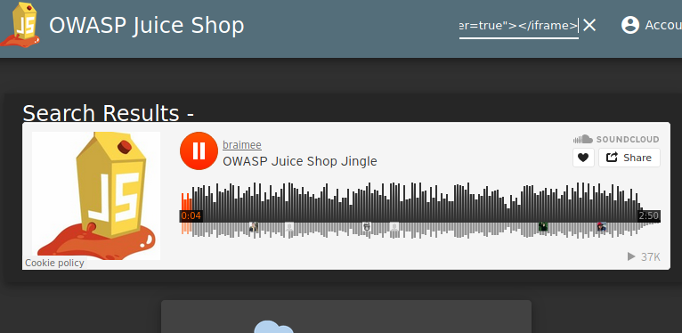

## Bully Chatbot

### Description

Receive a coupon code from the support chatbot.

### Exploitation

This was quite an easy challenge, I just complained to the chatbot a few times saying I wanted a refund or was unhappy with my order and got a coupon! It seams that the squeaky wheel gets the oil in this case.

## Confidential Document

### Description

Access a confidential document.

### Exploitation

This was actually found by my crawler / spider. The confidential document is viewable from the path &lt;url&gt;/ftp/

But this could also be found in the robots.txt

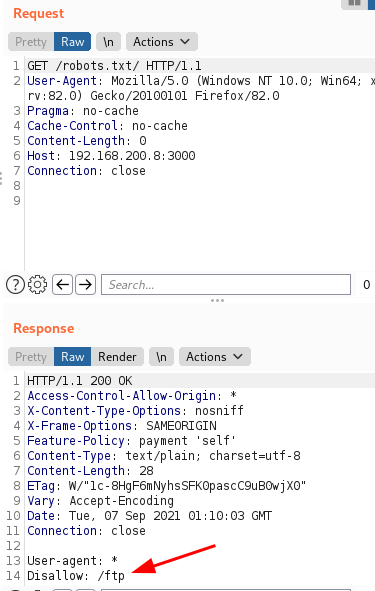

Browsing to the FTP site gives us access to some confidential looking documents, in particular 'acquisitions.md'

## DOM XSS

### Description

Perform a DOM XSS attack with ``<iframe src="javascript:alert(`xss`)">``

### Exploitation

To exploit this I looked around for user input fields. The first I tried was on a product review, but this didn't work, it just displayed the code:

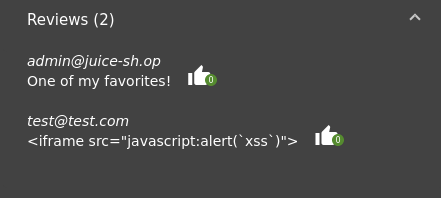

The next place I tried was the search bar.

When searching for a product, the search is reflected in the results as below

Here I've pasted the above code in the search field, we can see the alert popped up in my browser and the iframe loaded in the background; proving that it is vulnerable to XXS.

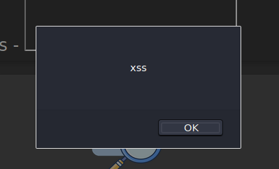

## Error Handling

### Description

Provoke an error that is neither very gracefully nor consistently handled.

### Exploitation

Here I was looking for a server side error, so my first thought is SQL injection.

So I tried putting in a single quote in several fields starting with the search field which didn't provide any errors.

However the login page seemed susceptible, putting a single quote in the username field generated this error:
 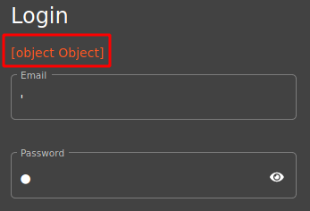

This solved the challenged.

The error doesn't look good (for the developer), so I went to Burp to see what it had intercepted as the server response.

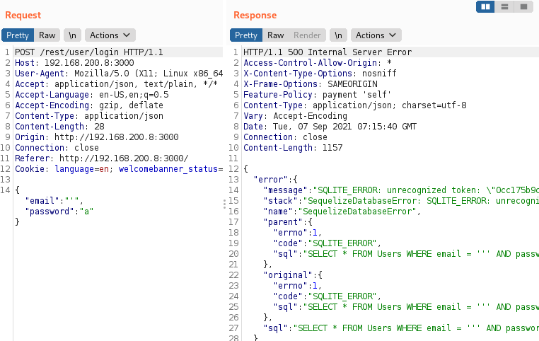

Here we can see some SQL code, that could easily be exploited further. More on that later ;)

## Exposed Metrics

### Description

Find the endpoint that serves usage data to be scraped by a [popular monitoring system](https://github.com/prometheus/prometheus).

### Exploitation

We note that the link provided points to Prometheus. The Prometheus documentation mentions some folder paths that can be used to access the content. Such as /metrics and /graphs.

The /metrics path yielded some results for us that completed this challenge.

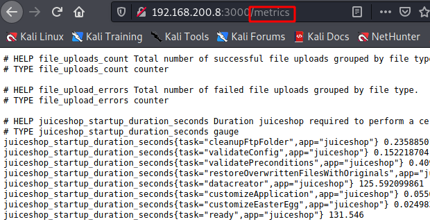

## Missing Encoding

### Description

Retrieve the photo of Bjoern's cat in "melee combat-mode".

### Exploitation

Looking at the photo wall there is one missing picture with the symbol of a cat.

This one had me for a minute, until I re-read the heading 'missing encoding'.

Now going to the element inspector we can see there are hashes # in the uri.

Looking up the HTML encoding values for these which is %23 then replacing that in the link did the trick!

Meeow!

## Outdated Allowlist

### Description

Let us redirect you to one of our crypto currency addresses which are not promoted any longer.

### Exploitation

In this one I searched through the JS code using the Firefox inspect element under the main-es2018.js

I searched for 'redirect' and 20 results showed up.

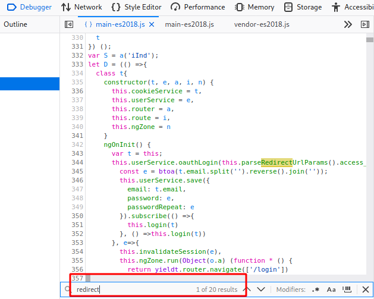

Going through these didn't take long to find a redirect referencing a bitcoin wallet.

Navigating to this redirect url completed the challenge.

## Privacy Policy

### Description

Read our privacy policy.

### Exploitation

This wasn't really an exploit, just ensuring that we are manually clicking around the site to check it out.

To get to this I created an account and logged in.

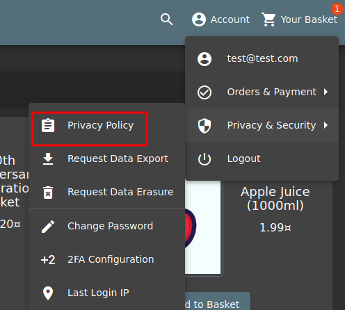

## Repetitive Registration

### Description

Follow the DRY principle while registering a user.

### Exploitation

The DRY principle refers to 'don't repeat yourself'.

This exercise shows a coding error in the user sign-up page.

Once filling out the registration page, including both the password fields (initial and repeat) you can go back and change the initial password and it doesn't re-check if the 'repeat' password matches.

Here we can see I can submit the form with different length passwords.

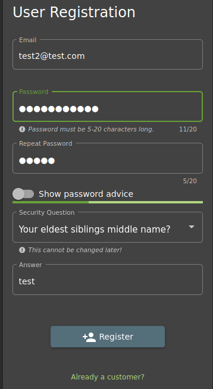

The user will then be created using the first password field, ignoring the second field entirely.

## Score Board

### Description

Find the carefully hidden 'Score Board' page.

### Exploitation

This was the first challenge I completed, when logging into a new Juice Shop instance it provides us with some notifications suggesting we look around for the score board.

My first instinct was to use type it in the url /scoreboard. This didn't work I then tried it hyphenated /score-board and got to it.

However it can also be found in the site code through the debugger looking at the main.js, by searching for 'score':

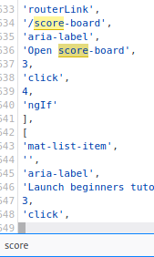

## Zero Stars

### Description

Give a devastating zero-star feedback to the store.

### Exploitation

There were two paths to this one, my first instinct was to use Burp Suite and intercept the post, editing the post data. So I'll go through that first.

Here we can see that I cannot submit the form until i give a rating, it must be higher that 0!

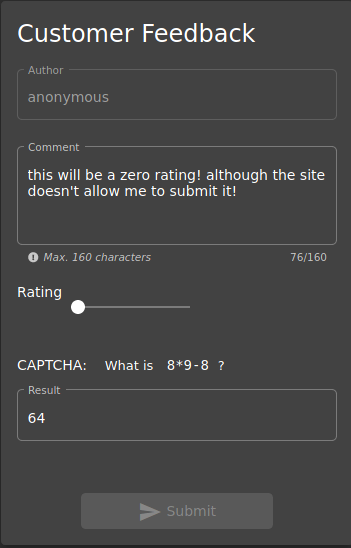

So I gave a rating of one and submitted the form with my Burp Suite Intercept enabled.

Now I'll change the rating to 0 in Burp and forward the post.

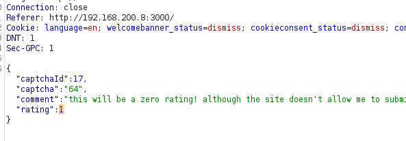

That solved the challenge!

The second way is to edit the javascript in the debugger.

If I remove the 'disabled=true' option replace it with enabled=""  then the button becomes enabled and allows me to submit with 0 stars!

Now the button is enabled and I can send in the form:

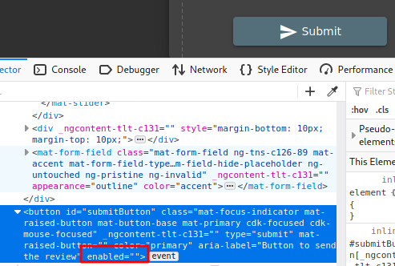

That's it for this level.

Thanks for reading! :)