SQL Injection Labs

# SQL Injection Labs

Below is a list of the labs on the Portswigger Web Academy for the SQL Injection labs.

## Lab 1

**Description:** SQL injection vulnerability in WHERE clause allowing retrieval of hidden data. This was a simple SQL injection to get more data from the DB than intended. Adding `‘OR 1=1 --` to the query provided additional results.

## Lab 2

**Description:** SQL injection vulnerability allowing login bypass

There is a login page, with a username and password.

It seems to be using a post method, after attempting a login it doesn’t show the username / password in the address bar, so I’ll capture it with Burp and try and injection attack that way.

I’ll turn on Burp Intercept and edit the post. I’ve changed the username to administrator’-- in attempt to bypass the password check.

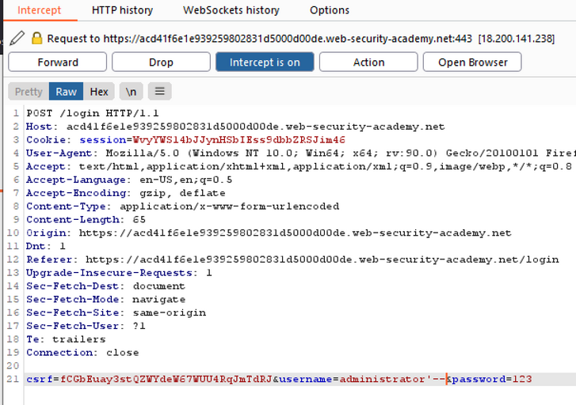

That got me in

## Lab 3

**Description**: SQL injection UNION attack, determining the number of columns returned by the query

To solve this I inserted the following into the URL bar ' UNION SELECT NULL,NULL,NULL--

doing more than 3 NULL’s produced an error, therefore there were 3 columns.

 

## Lab 4

**Description**: SQL injection UNION attack, finding a column containing text. Make the database retrieve the string: 'fgAEo0'

First I’ll attempt to determine the number of columns.

Using ORDER BY, I was able to determine that there are 3 columns of data returned in this query.

Trying the same attack with 4 produced an error.

No I will try and determine which columns can contain strings.

Using a UNION I was able to determine that the second column contains strings.

Here we can see I have inserted the letter ‘a’ into the results.

So here I have injected the string as requested by the lab.

## Lab 5

**Description**: SQL injection UNION attack, retrieving data from other tables. The database contains a different table called users, with columns called username and password. To solve the lab, perform an SQL injection UNION attack that retrieves all usernames and passwords, and use the information to log in as the administrator user.

First I’ll work the number of columns and which columns can contain strings, using ORDER BY and UNION SELECT ‘a’, NULL style attacks.

Using ODER BY 2-- has worked, but anything above this produced an error. So we have two coloumns.

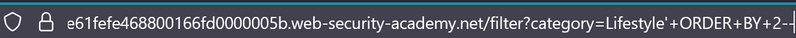

Not to test for string fields in the results, based off the content I’d suggested they’re both strings, but will run the exercise.

Here we have it, both columns are strings, as can be seen by the inject A and B below.

Not for the interesting information from the ‘users’ database.

Here is the query

And we have some nice results in our content

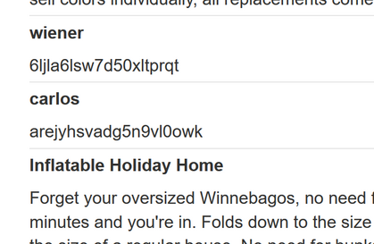

And the administrator’s account was further down:

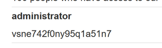

Now to login with those credentials to finish the lab.

I’m in!

## Lab 6

**Description**: SQL injection UNION attack, retrieving multiple values in a single column. The database contains a different table called users, with columns called username and password. To solve the lab, perform an SQL injection UNION attack that retrieves all usernames and passwords, and use the information to log in as the administrator user.

First I have determined that there are 2 fields and the second field contains strings using a UNION SELECT NULL attack as follows:

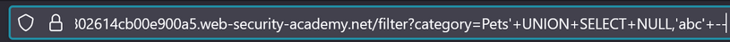

Now that I know the second field is a string I’ll try and pull the username / password combo into that field.

Here is the URL I used to join the two fields into one, and we now have the login credentials in our website output.

 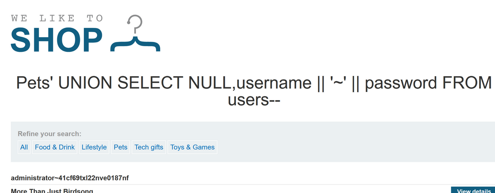

Now to login as the administrator to complete the lab.

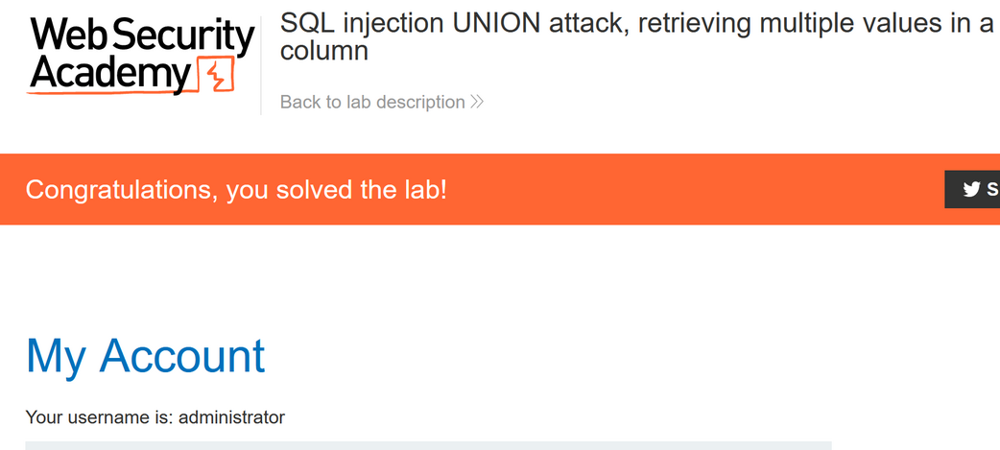

## Lab 7

**Description**: SQL injection attack, querying the database type and version on Oracle

First I’ll determine the number of columns, then determine which are strings.

With this query I was able to see that there are two string fields I can use.

Now to get the version name

Using the SQL injection cheat sheet on Portswigger I put together the following querying

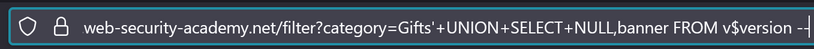

This printed out the version information into one of the text fields on the webpage.

Lab solved

## Lab 8

**Description**: SQL injection attack, querying the database type and version on MySQL and Microsoft

First I determine the number of columns. I had to add a space after the double dash at the end to make this query work. So at this stage I’m assuming it’s MySQL.

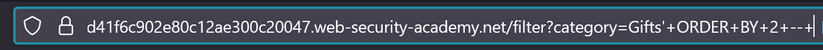

Now the column types

We can see that both columns are text.

Now I will query the version, attempting a MySQL query first.

Here is the query

And we can see the version results here:

And the lab is done

## Lab 9

**Description**: SQL injection attack, listing the database contents on non-Oracle databases.

This lab contains an SQL injection vulnerability in the product category filter. The results from the query are returned in the application's response so you can use a UNION attack to retrieve data from other tables. The application has a login function, and the database contains a table that holds usernames and passwords. You need to determine the name of this table and the columns it contains, then retrieve the contents of the table to obtain the username and password of all users. To solve the lab, log in as the administrator user.

Looks like we have two columns of text type.

So now I’ll try and get some database names…

I used this query:

And got a huge list, now I’ll start looking through for a ‘users’ type database and query the table’s columns.

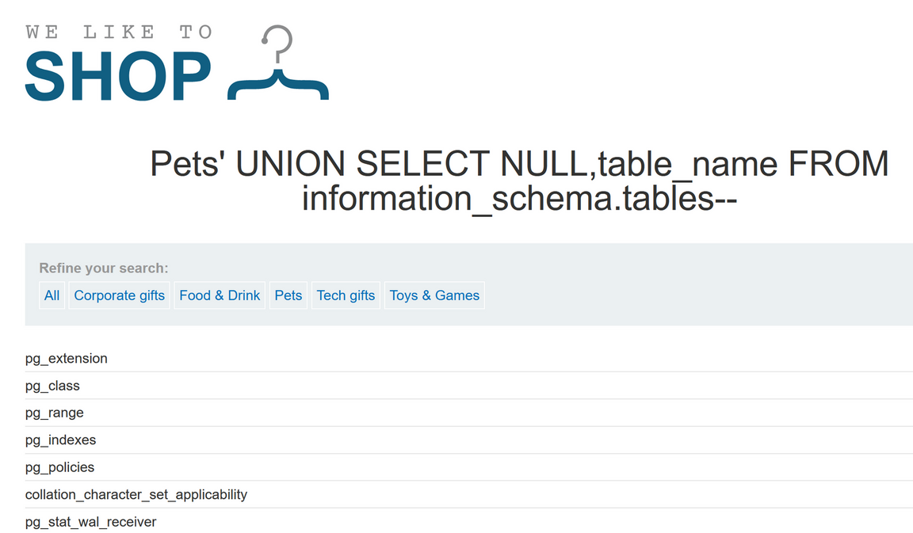

Found one called users_xagzie which might be interesting.

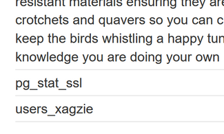

Now to query this DB’s columns.

This is the query I used, and got some hits in the results.

The column names are:

username_ujsjvf

password_vxcwmu

Now to query the database to spit out the contents we’re after. Usernames and passwords.

And here we have it, they query:

And some interesting results:

Now to login and finish the lab

## Lab 10

**Description**: This lab contains an SQL injection vulnerability in the product category filter. The results from the query are returned in the application's response so you can use a UNION attack to retrieve data from other tables. The application has a login function, and the database contains a table that holds usernames and passwords. You need to determine the name of this table and the columns it contains, then retrieve the contents of the table to obtain the username and password of all users. To solve the lab, log in as the administrator user.

First I’ll work out the column numbers are data types

Seems there are two columns:

Both are text fields.

Now to get the database names, this query got me the database names.

This table name looks interesting

Now to get the column names:

Here are the column names we’ll use to get the credentials out.

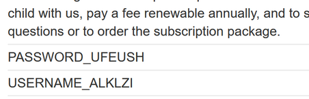

PASSWORD_UFEUSH

USERNAME_ALKLZI

And now we have the credentials, here is the query:

And the data:

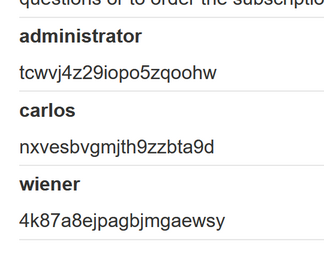

And the lab is solved:

## Lab 11 (Blind Injection)

Description: This lab contains a blind SQL injection vulnerability. The application uses a tracking cookie for analytics, and performs an SQL query containing the value of the submitted cookie.

The results of the SQL query are not returned, and no error messages are displayed. But the application includes a "Welcome back" message in the page if the query returns any rows.

The database contains a different table called users, with columns called username and password. You need to exploit the blind SQL injection vulnerability to find out the password of the administrator user.

To solve the lab, log in as the administrator user.

To start off, we can test our injection with the ‘welcome back’ message here using the Repeater function in Burp.

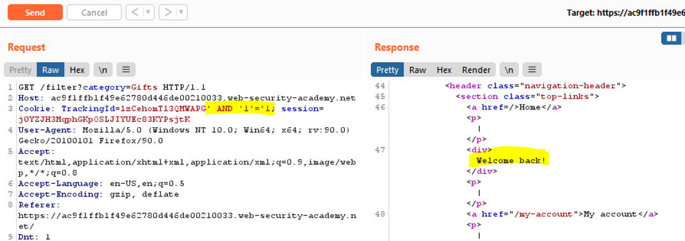

Now if we inject ‘ AND ‘1’=’2 into the cookie field when we capture this in Burp we can see this message is removed, so it is vulnerable.

This change in the site indicates our injection worked.

Now I’ll move on to the next step, we’ve been told a database name and account to try and get the password out one letter at a time.

First I need to see if it’s Orcal or not, so will start using the Oracl based SUBSTR query and see if we can get a positive response.

After some trial and error, I managed to get a successful injection advising us that the first letter of the password is less that z. Now I can move this request into the intruder and try to brute force each char in the password, one at a time.

I used the SUBSTR command indicating that it is likely an oracl db.

' AND SUBSTR((SELECT password FROM users WHERE username = 'administrator'), 1, 1) < 'z

I’ll setup the intruder function with a list of the alphabet and change the char each round.

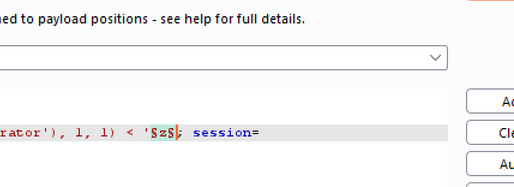

A quick python script to print the range of chars I’ll use in the attack. I’ll start with letters.

Turns out I don’t need this, Burp has a brute forcer option that I’ll use!

I’ll start with lower case

So far so good, we have the first char. ‘b’

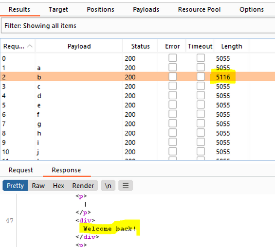

Now for the rest, I’ll update the SUBSTR request and use the ClusterBomb attack tool to traverse through the password positions and chars. This will take some time since Burp Community is throttled. If it takes too long I might jump over to OWASP ZAP.

It’s getting therem but taking it’s time.

While that’s happening I’ll setup ZAP and see if I can beat this attack with another.

I noticed the attack is missing a few positions, that must be uppercase letters or special chars which I’ll try and get on a second attack.

So OWASP Zap was much much faster, I got 15 chars so far, Burp is only a third of the way through due to the throttling.

The password was long so I did a second batch to test positions 15-30 in ZAP.

Here are the results.

So the password is: bd6hlz8l16gqrcwa3os1

And that did it

I’m in.

## Lab 12: Blind injection

**Description**: This lab contains a blind SQL injection vulnerability. The application uses a tracking cookie for analytics, and performs an SQL query containing the value of the submitted cookie.

The results of the SQL query are not returned, and the application does not respond any differently based on whether the query returns any rows. If the SQL query causes an error, then the application returns a custom error message.

The database contains a different table called users, with columns called username and password. You need to exploit the blind SQL injection vulnerability to find out the password of the administrator user.

To solve the lab, log in as the administrator user.

First I’ll try and inject a conditional error based code and determine which database i.e. which conditional statement I need to use.

So I got a little stuck and didn’t think of using the double pipe to concatenate the queries. That was a good lesson.

After know that I constructed the following to test if I could get an error.

After trying the different conditional error methods on the SQL injection cheat sheet I had the above begin to work. Where having the 1=1 case provided an error and having 1=2 displayed the normal page. So I can infer that this is a Oracl DB.

Now with this I can amend the condition to check for the administrator’s password in the users database as in the last lab.

I’ll use ZAP again just because the fuzzer is quicker that the community burp.

Now I havea query that is working with the username/password lookup.

I’ll adjust it to error if the letter in the password position is NOT correct.

This will be my payload.

'||(SELECT CASE WHEN (SUBSTR((SELECT password FROM users WHERE username = 'administrator'), 1, 1) != 'a') THEN to_char(1/0) ELSE NULL END FROM dual)||'

I’ll adjust the position in the SUBSTR and the char I’m testing for and put this through the fuzzer.

If the page loads correctly in the fuzzer I should have a char from the password.

Here is my fuzz attack.

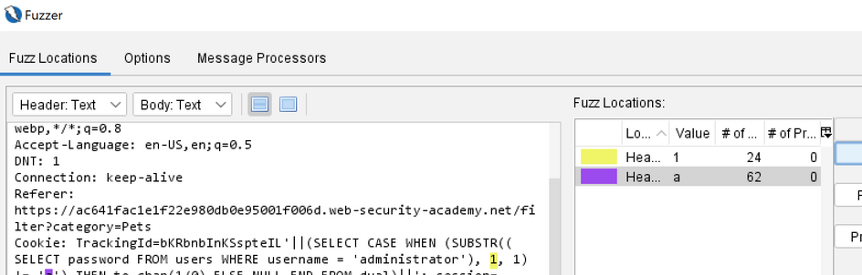

After running the attack for a few mins I have a list of chars and their position in the password.

The password is: 321sd9cysa3kngnx3wnm

Now to login.

Lab done.