# Authenticate Room

Learn how to attack authentication mechanisms used in web applications.

## Dictionary Attack

Here we will use OWASP ZAP to perform a dictionary attack on a web portal. The process is similar in Burp, Burp is just slower due to throttling.

We have a username and password field on the target host.

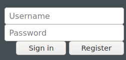

I'll turn on the proxy intercept and capture a login attempt.

As you can see above I've captured a login attempt and sent it over to Fuzzer. Now I'll load a dictionary file and start the attack.

Note we have been given the username 'jack' in the room, so we'll just attack the password field.

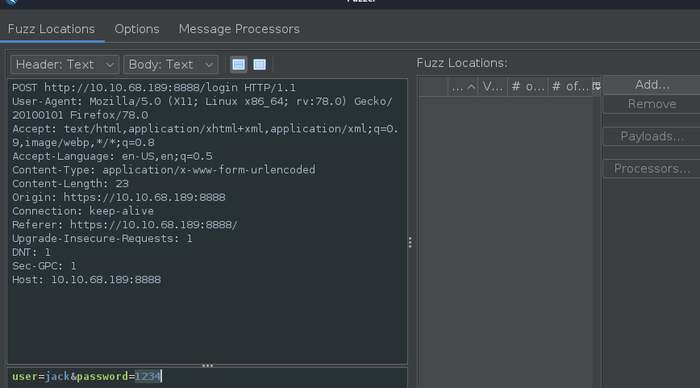

I've loaded our rockyou dictionary as the payloads.

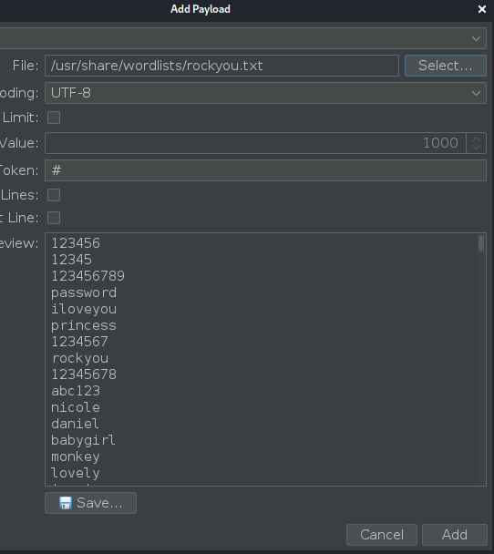

After a short while, we look for differences in the response sizes.

Here we can see a unique one, which would be our password!

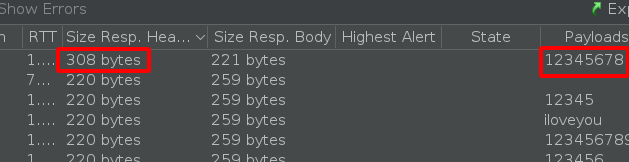

And here we have our flag.

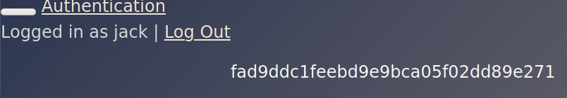

Now we've been told to do the same thing with the username 'mike'.

Here are the results

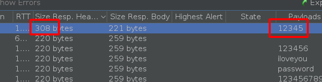

And our flag

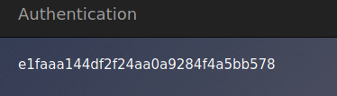

## Re-registration

Here we will re-register an account 'darren'.

When trying to register darren we can see the account already exists

So now we will register ' darren', noting the space at the start.

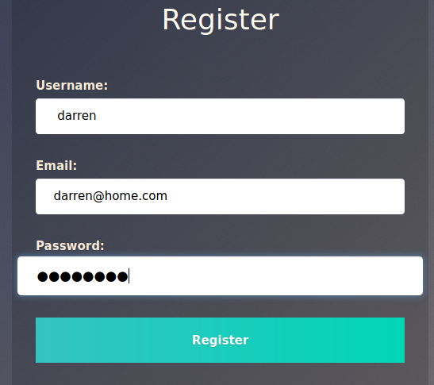

This has worked!

Logging in with our new user, has shown us darren's account information i.e. the flag!

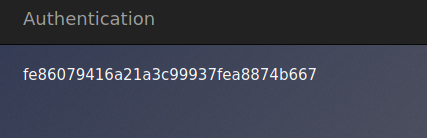

Now we do the same thing with the account 'arthur', here is the flag.

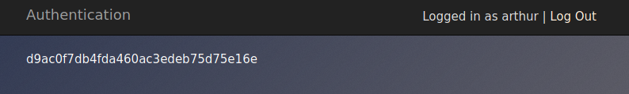

## JSON Web Token

Here we will exploit an incorrectly configured JSON Web Token authentication.

We capture the JWT

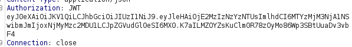

And send it to the decoder, decoding it from BASE64

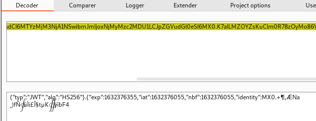

Now we change the encryption method to none and the user ID and re-encode it

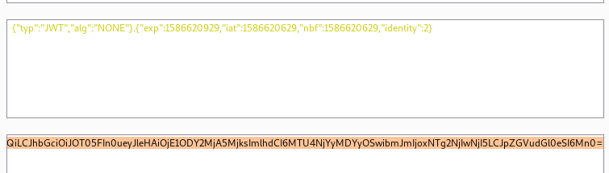

We enter the encoded values into the Authorisation JWT token section of the request, and we bypass the security!

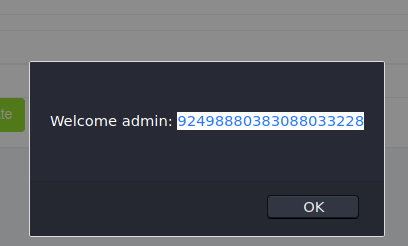

## No Auth

Here we will look at access control issues where we can get access without any authentication necessary.

In this example, when we login we can see a user ID in the URL path.

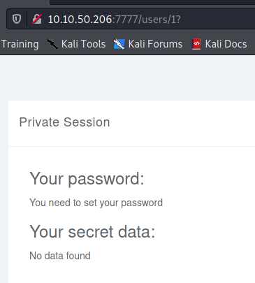

Changing this ID number allows us to access other user account's information.

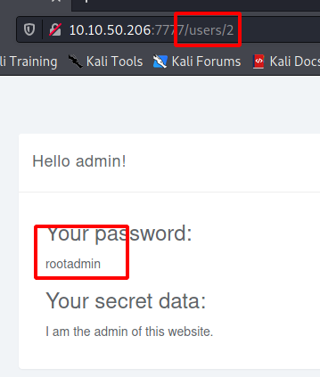

Trying some different user ID accounts we discover the superadmin account and the flag!

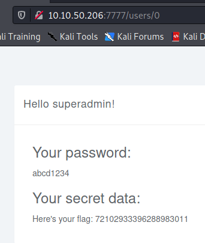

That's it for this lesson!