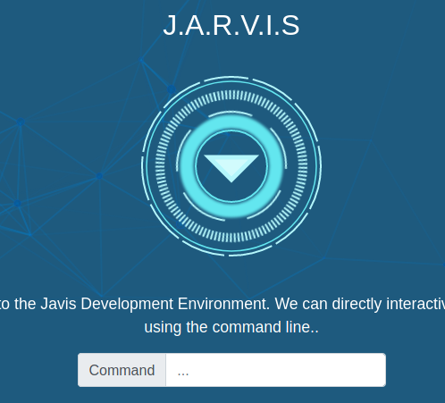

# Avengers Blog

Learn to hack into Tony Stark's machine! You will enumerate the machine, bypass a login portal via SQL injection and gain root access by command injection.

Let's hack the avengers!

Hope I don't get hulk smashed ;)

Here is our blog

For our first flag we're advise to find the cookie!

Here we go!

The next payload is in the response header from the server, using Burp we can find it easily here:

Next we need to access the FTP server on this device.

We've given a hint to look at the forum, we can see groot has a predictable passwords...

And we're in!

Here is our next flag

Now we need to look for some hidden folders, a login page ideally.

Gobuster here we come!

Some good stuff here, we're interesting in 'portal' as this seems to be their login page.

Now we're going to login here apparently, there might be a SQL injection flaw! Tony... shame...

Username and passwords as the above!

And we're in, not the flag at this point (flag4) is the line count of the code for this site. 223.

Command injection time!

A little hunting, and we can see a flag file, which is what we want!

Command is disallowed :(

We need an alternative to cat i think...

Bingo!

Our flag done :)

That's it for this room.