# Burp Suite Practicals

The Burp Suite section of the course gives us tutorials on using the different Burp tools.

## Repeater

Here is an example of the repeater, we add a new header into the request captured from the proxy, then forward it on to get a flag!

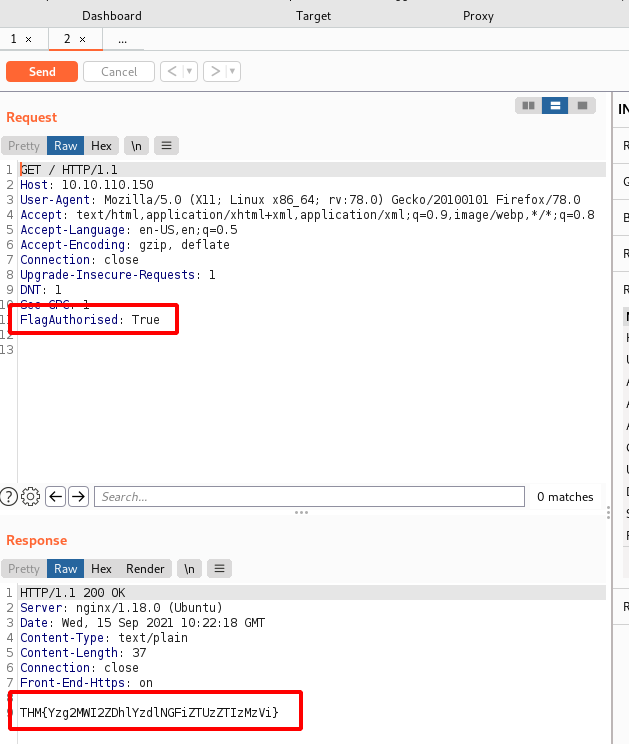

Next we will capture another request in the products section and send it to the repeater again.

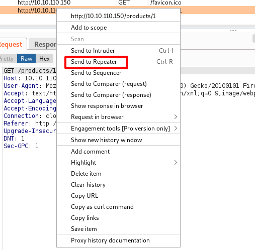

Now we will change the product request to try and get a server error 500.

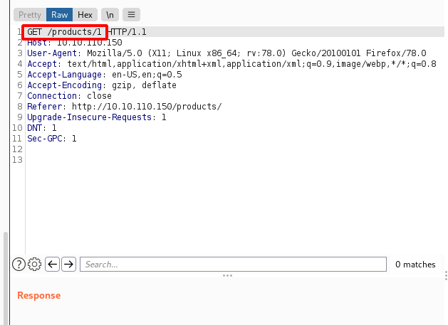

Trying a 'reasonable' number just gives us a 404 error when the product doesn't exist.

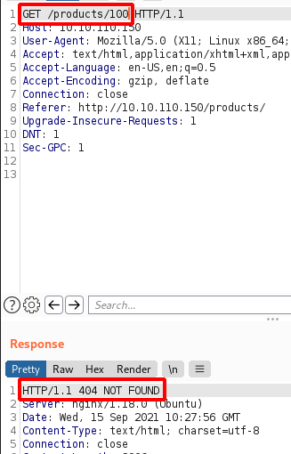

Trying negative numbers gave us an internal server error!

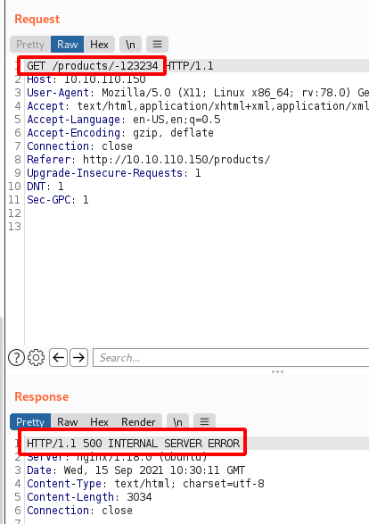

And the flag we were after!

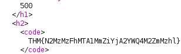

**Manual Testing for SQL injection:**

First we will request the page with the flaw on it and send it over to the repeater.

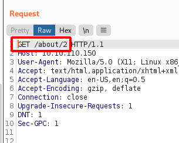

Now I'll add in a basic SQL injection test, a single quote at the end of GET path.

This generated an error which is good for us (not good for the site owner though!)

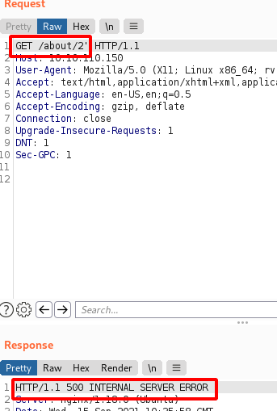

The response has actually shown us the SQL query in the server error.

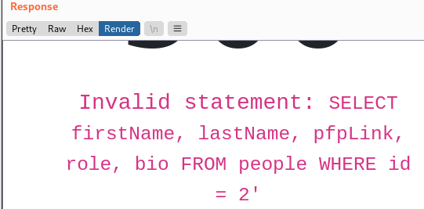

Now we know the table name, some columns etc.

Now for a more interesting query, to get the columns in the table.

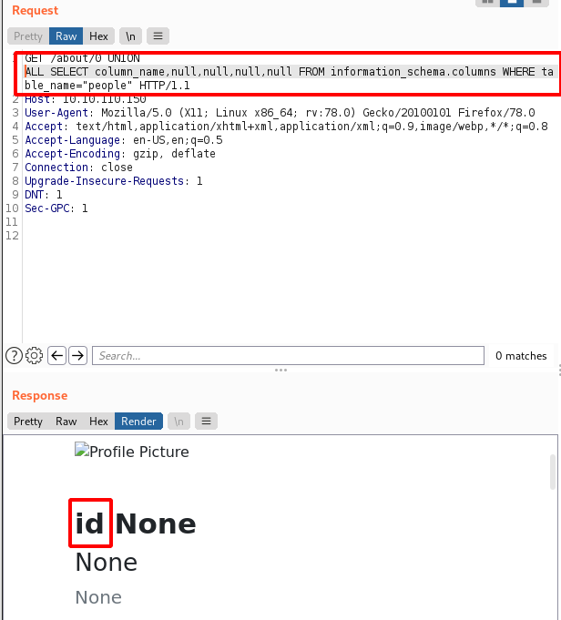

Now we have the column name of the first column, but not the rest. So we'll use group_concat().

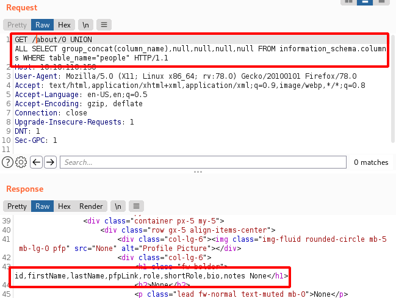

Now we have all the column names! So we're going to read the 'notes' column of the CEO to get our flag. The CEO is id=1 which we can see from navigating the site's about page.

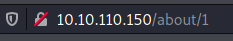

Here we have it!

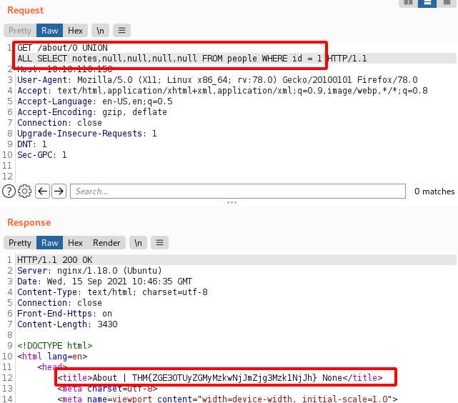

## Intruder

Intruder is used for fuzzing, there are 4x attack modes

**Sniper:** One set of payloads, putting each entry in each defined position (or parameter). The payloads will not be combined across positions. Only 1 payload will be used per attack. This is more ideal for single position attacks. e.g. passwords with a known username.

**Battering ram:** Takes one set of payloads, like Sniper, but will put the same payload in all defined positions (or parameters) during each attack. E.g. a payload of 'admin' with two parameters will put 'admin' in both parameters for the attack.

**Pitchfork:** Takes two or more sets of payloads (max 20). Pitch fork iterates through both payloads list simultaneously, using the same position in each payload list for each attack. E.g. a payload list of 1, 2, 3 and a, b, c, for two parameters, will use payloads as 1-a, 2-b, 3-c then finish. Ideally the payload lists should be the same length.

**Cluster bomb:** Takes multiple payloads, however iterates each payload list individually, allowing for 'cross' payloads. e.g. payloads of 1,2,3 and a,b,c will iterate like this: 1-a, 1-b, 1-c, 2-a, 2-b, 2-c etc... Essentially iterating through every possible combination in the payload lists.

**Brute Force Login**

Here we will brute force a login with a credential list provided on the target machine.

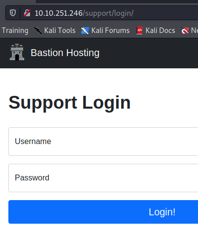

Here we have a captured login attempt.

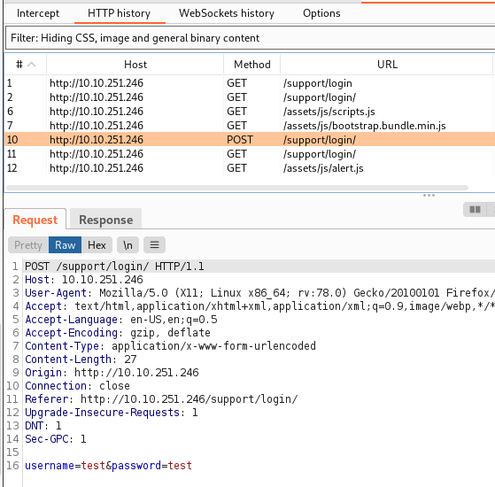

We will send this request over to Intruder to attack this form.

In the request below, we have selected the username and password fields to run our attack against.

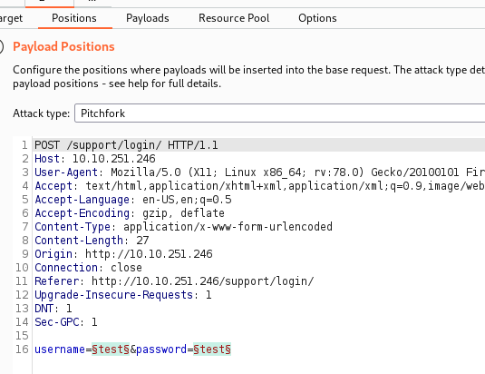

We've loaded the provided user and password lists into payloads 1 and 2 respectively.

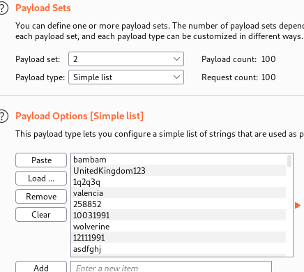

After the attack has completed, we can sort by response length or status code to look for differences. In this case the response length was different for one of the login attempts, indicating that this is our user / pass combo!

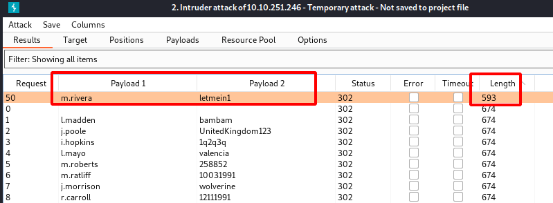

**Challenge**

Now that we can login, we will attack the support tickets part of the site, seeing if we can access other tickets that are not assigned to our user.

Here we've logged in with the credentials we received from the previous exploit.

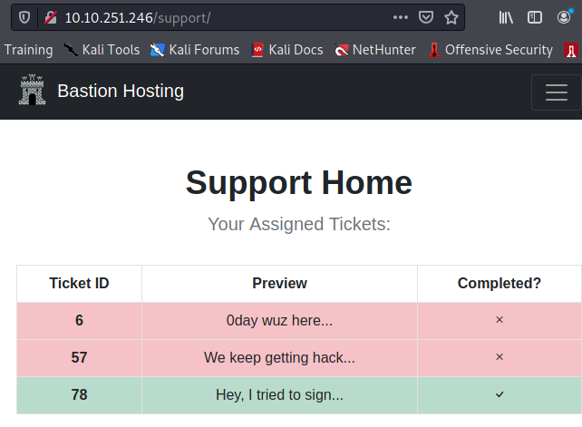

We can see some ticket numbers in the support page.

The ticket numbers are referenced in the URL

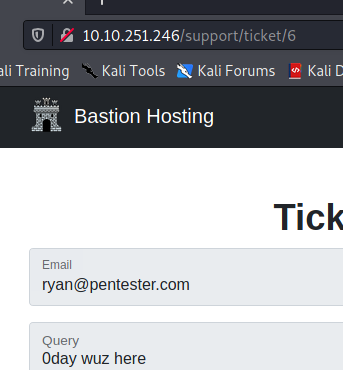

Se we can exploit this, assuming access control is not setup properly allowing for IDOR.

Sending our previous request to view ticket 6 to the Intruder, we will use the sniper attack with a range of ticket numbers and see what we can see. I'll leave the cookie in tact so we remain authenticated, and just attack the GET request path.

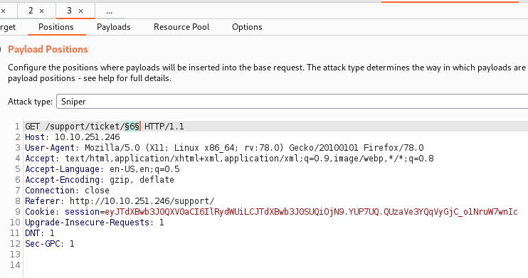

I'll use a numbers payload from 1 to 100.

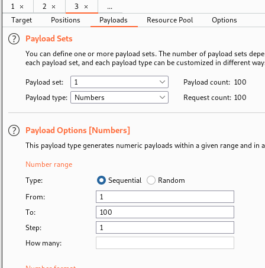

We can see here that we have accessed additional tickets that our login didn't have access to originally. Indicating the IDOR vulnerability.

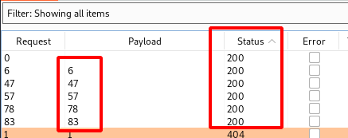

And here is the flag

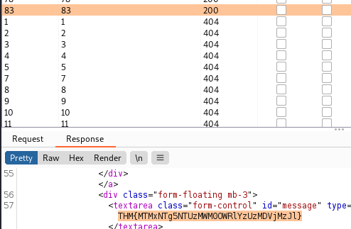

**CSRF Token Bypass**

Here we will attack the admin login port, that uses a CSRF Token.

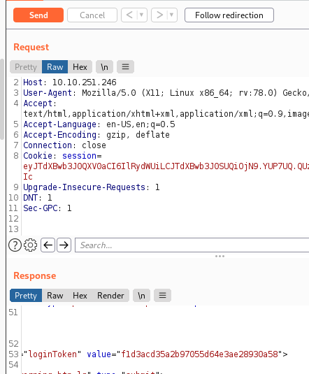

In a captured request, using the repeater I can quickly see that the 'loginToken' value in the response changes and a session cookie that changes. We will need to change these for each login attempt accordingly. For this we can use Macros in Burp.

First we'll send our login request over to Intruder.

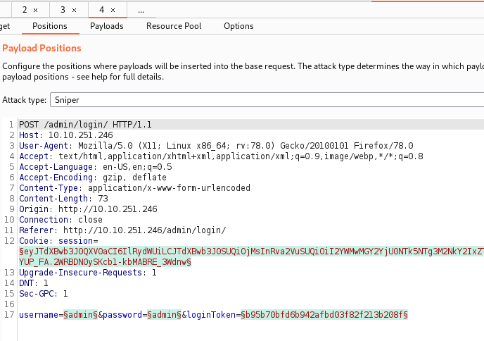

We will now add a Macro to get the CSRF token

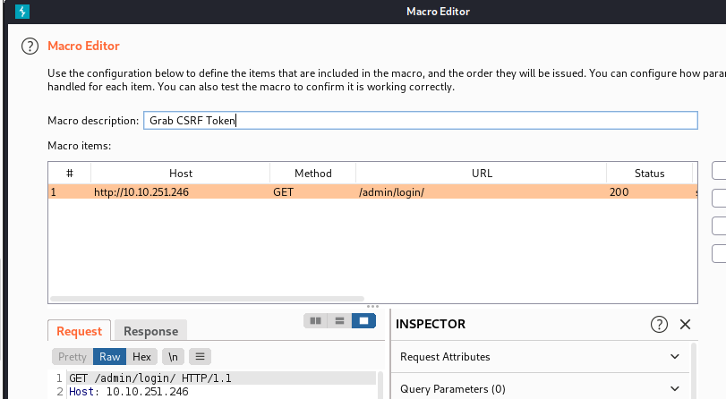

Then we'll add the macro to run for our session handling rule, ensuring it only changes the loginToken field and session cookie.

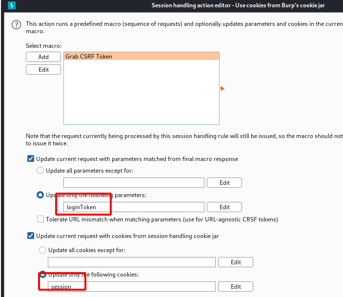

Now the macro is added:

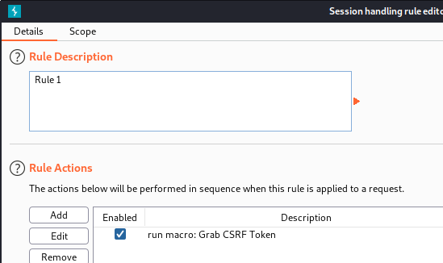

Here is our intruder attack setup

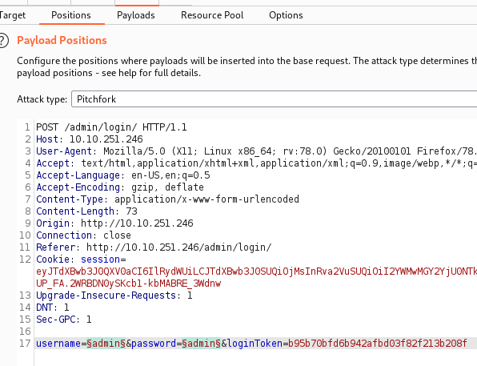

I'll load the same lists and use pitchfork like the previous attack we just completed.

After running our attack, one login stands out:

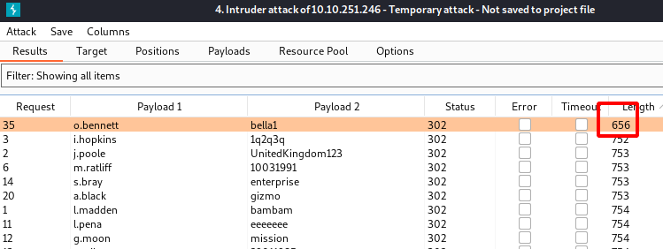

Trying these credentials has logged us in!

After a successful login, we can see the flag in the source code.

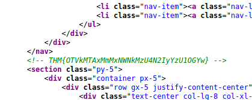