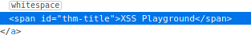
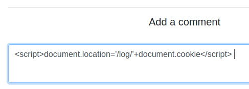
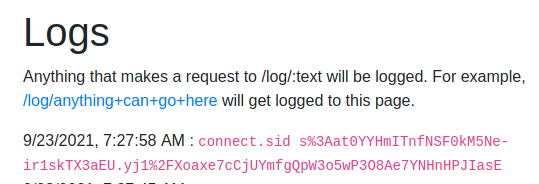

# Cross-site Scripting

Understand how cross-site scripting occurs and how to exploit it.

This room consists of a series of challenges around different types of XSS.

To get started I need to setup an account on the target host.

I'll use my nickname Robbie and begin with Reflected XSS.

## Reflected XSS

We have a search field here that displays our search text above the field after entering it.

Now to try a basic payload to test for XSS.

this worked!

Now we need to get the host IP, a quick google advises that Javascript can request the IP with location.host, so we'll try to fit that in our alert box.

And here we have it!

## Stored XSS

Here we have a comments section on a site we can enter text into.

I'll try some HTML code

And this worked!

Now I'll try and get the document.cookie on our account with an alert box.

Here we are!

Now we have to try to change the title in the page with Javascript. We're changing the heading "XSS Playground" to "I am a hacker".

Looking at the source we can see the id of the title here

Here is the payload I'll use to make the change.

Success!

Now for the final stored XSS task, we're going to hijack jack's account and post a comment as him.

This site has a built-in capture page called logs so I can use that instead of setting up my own web-server for this task.

Then we'll use this payload to send a get request to my server each time a user loads the site.

Heading over to our logs page we can see a cookie there!

I'll change my cookie using the developer tools

Now after refreshing the page, I'm Jack!

Now I can post as him!

## DOM Based XSS

We need to find where we could insert a javascript alert on this page, which displays our cookie.

We can see the vulnerable code here:

It looks like we could insert some script code directly into the img-url field.

I'll try to use standard injection and comment out the reset of the line so I can add my own onerror code.

x'" onerror=javascript:alert(document.cookie) alt="Image not found..." width-400>' //

That seemed to work

The challenge wanted us to use mouse over, so I used this payload to receive the same results but when hovering over the image area.

x" onmouseover="alert(document.cookie)"

Next we need to change the background to red. A quick google and we get the following code to change the background colour, I'll place the code in the same payload as above.

x" onmouseover="const body = document.body;body.style.background = 'red';"

## Filter Bypass

Here is a set of challenges to bypass code filters used in attempt to remove code from input fields.

Challenge 1: Are you able to bypass the filter that removes any script tags.

As expected our 'script' word was removed.

Using the img tag worked ok, here is the payload: &lt;img src=1 href=1 onerror='alert("Hello");'&gt;&lt;/img&gt;

Challenge 2: The word alert is filtered too.

This time we'll use the confirm feature instead of alert with the payload: &lt;img src=1 href=1 onerror='confirm("Hello");'&gt;&lt;/img&gt;

This did the trick!

Challenge 3: The word Hello is filtered.

This time I'll write the word Hello nested so it filters out the middle part, leaving the rest remaining. E.g. HeHellollo.

So our payload will be: &lt;img src=1 href=1 onerror='alert("HeHellollo");'&gt;&lt;/img&gt;

That did the trick!

Challenge 4: Filtered is the following:

word "Hello" script onerror onsubmit onload onmouseover onfocus onmouseout onkeypress onchange

I did some research to find other events I might be able to use. This link was useful: https://www.w3schools.com/tags/ref_eventattributes.asp

I used the 'onclick' event with this payload: &lt;img src=1 href=1 onclick='alert("HeHellollo");'&gt;&lt;/img&gt;

And clicking on where the image should be worked ;)

The lesson had some other interesting information regarding Javascript port scanners and keyloggers, which could be very dangerous and this all just demonstrates how important it is to control XSS on your website.

That's all for this lesson!