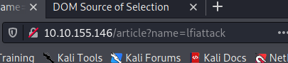
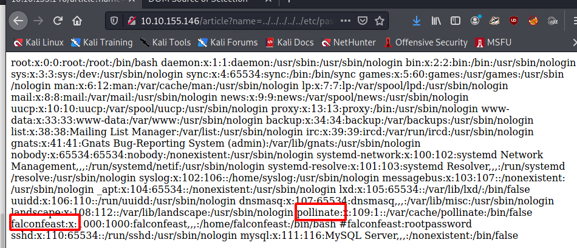
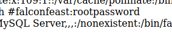
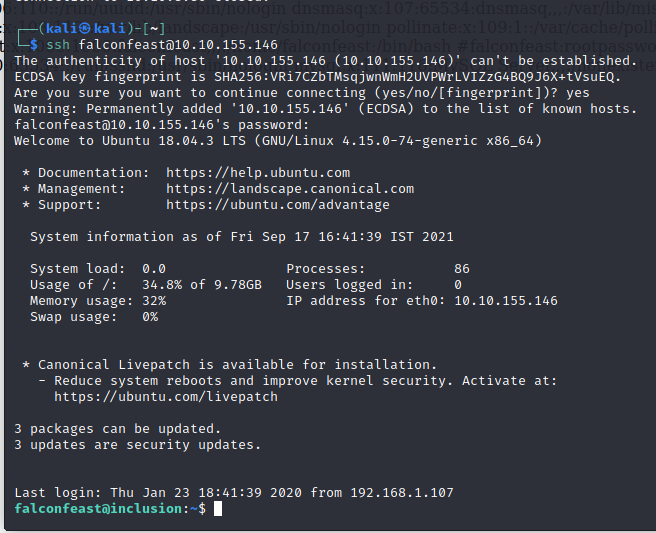
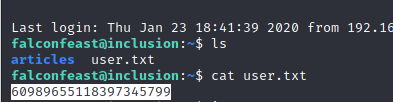
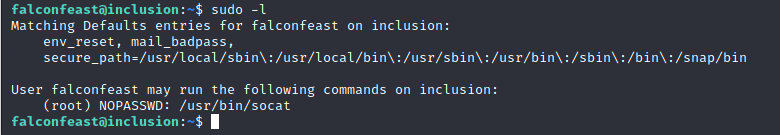
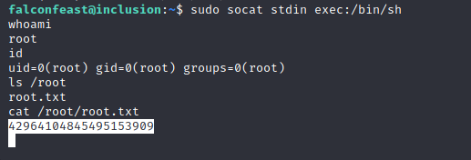

LFI Inclusioon Room

# LFI Inclusion Room

This is a simple room, designed to exploit LFI on a web server.

The room has two flags a user and a root flag.

Here we can see a possible attack vector in the URL.

I'll check it for LFI, considering the name of the room ;)

Success!

We have a few use accounts here we can inspect.

There is also an interesting comment in the above file

Those credentials have worked for us!

Here is the user flag

Now for privilege escalation, socat might be intresting

This link is helpful https://gtfobins.github.io/gtfobins/socat/

And here we have it, root access and the root flag!

