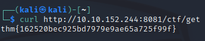
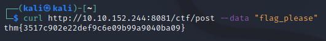
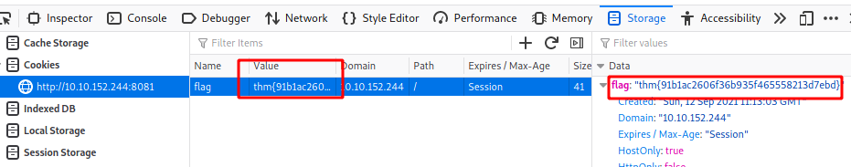
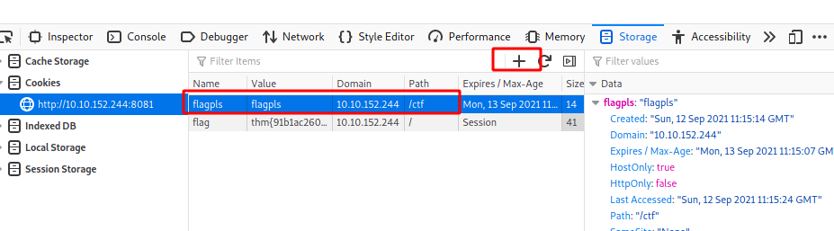
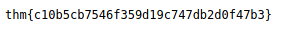

# Mini CTFs

This section I'll put my write-ups and screen shots of the mini CTF  / practical activities that are included throughout the learning materials of the Web Fundamentals Track in TryHackMe.com

## HTTP Requests

This is a mini ctf from the Web Fundamentals HTTP course.

Room: https://tryhackme.com/room/webfundamentals

### Description

There's a web server running on http://10.10.152.244:8081. Connect to it and get the flags!

1.  GET request. Make a GET request to the web server with path /ctf/get
2.  POST request. Make a POST request with the body "flag_please" to /ctf/post
3.  Get a cookie. Make a GET request to /ctf/getcookie and check the cookie the server gives you
4.  Set a cookie. Set a cookie with name "flagpls" and value "flagpls" in your devtools (or with curl!) and make a GET request to /ctf/sendcookie

### Write-up:

Here I will just list the activities screen shots of the task being completed and provide notes where something my need clarity.

With Firefox:

With firefox, I added the new cookie using the + icon in the cookies section of storage.

Flag:

