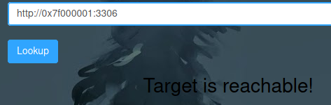

# SSRF - Server Side Request Forgery

This room aims at providing the basic introduction to Server Side request forgery vulnerability(SSRF).

We can use SSRF when the server makes a request or another URL without sanitising the input. We can use this to access URLs that the server might be allowed to access, but external devices cannot. E.g accessing a local port that is otherwise blocked by a firewall.

Here we have an example of a vulnerable SSRF form, we will try to determine how many ports are open, internally and externally.

Trying this payload we can see we get an error, so there is some filtering happening.

So I'll try another payload

Trying these payloads resulted in the same error http://localhost:3306 and http://:::3306 and http://\[::\]:3006

Next I'll try a hex based payloads: http://0x7f000001:3306

This was a success:

We could now use this process to try and determine which ports are open.

I'll use ZAP's fuzzer, here I've captured a request

Now I'll fuzz the port component of my request and look for different sizes in the response.

Here is the fuzzer setup to scan 10000 ports. We could make educated guesses on the ports manually e.g. look for standard DB ports or SSH etc, but I wanted to try this method.

After scanning for a few moments, we already have a hit, port 22.

We can see the response size differs slightly.

The response size of 1041 is a success:

After about 5 mins the fuzzer completed scanning 10000 ports and we have the following results. Note that the first result was the original payload using port 3306, which is a duplicate results.

As per above we can see 5 ports open to us: 22, 3306, 5000, 6783, 8000.

Next we'll try using the same method to read a local file with the payload file:///etc/passwd

This was a success! We can see the file contents here!

That's all for this room!