# ToolsRus

Practise using tools such as dirbuster, hydra, nmap, nikto and metasploit

This room has a few questions to answer, to get the answer's we'll need to user a variety of tools!

Our target

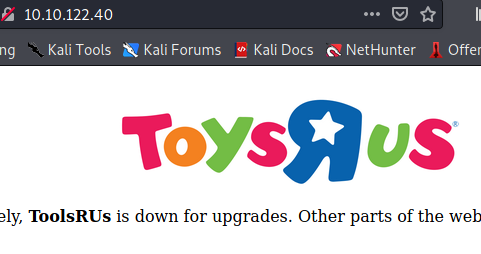

We need to enumerate folders, finding ones that start with G.

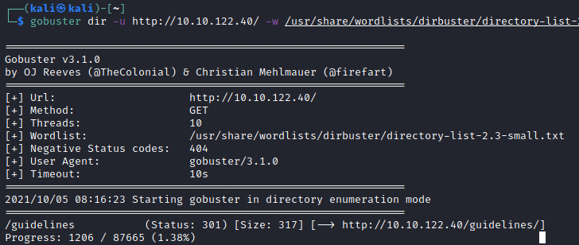

Our first answer is guidelines.

Now we need to find a name in this directory?

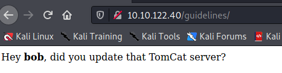

BOB!

Next question is which folder has basic authentication?

Gobuster is still running and has more folders for us

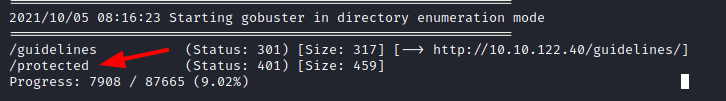

Browsing to this folder shows us the authentication

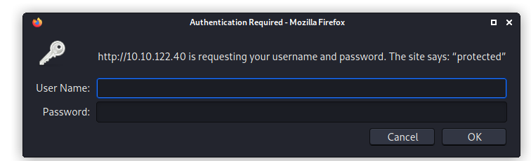

Now to find Bob's password, I'll try the rockyou password list.

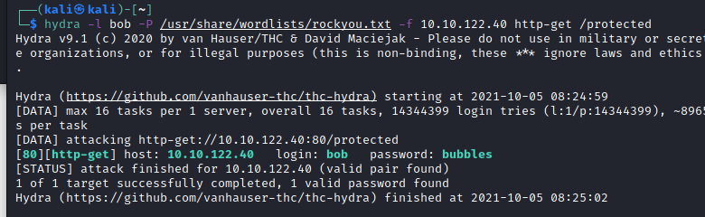

That was quick!

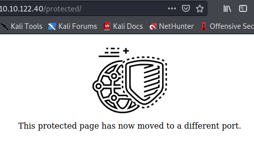

Apparently this page has moved ports! i'll use nmap to try and find it!

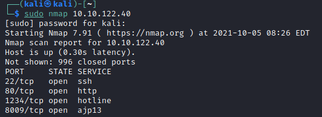

We have some ports! 1234 is the next one we're going to look at.

A bit more info this time

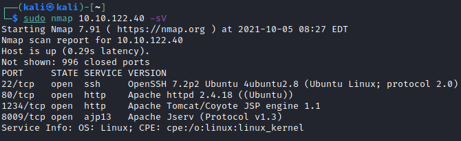

Now we'll use Nikto to scan that port in folder manager/html with the creds we've got. We need to find out how many documentation files there are.

This scan took over an hour! But the answer was 5 :) 

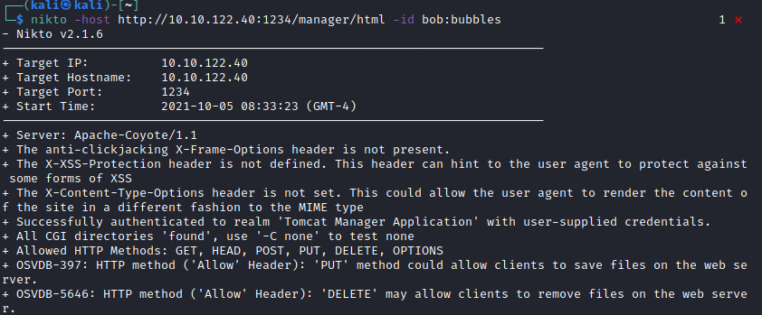
I didn't screen shot the answer because I uploaded this to github already!

The next questions were just versions numbers in the nmap scan above, so I won't list them in the write-up.

Now we need to try and get a shell with metasploit...

First I tried the tomcat mgr deploy, but that failed.

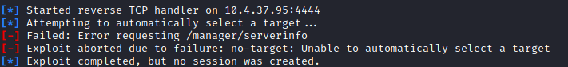

Next I tried the upload module and we had a winner!

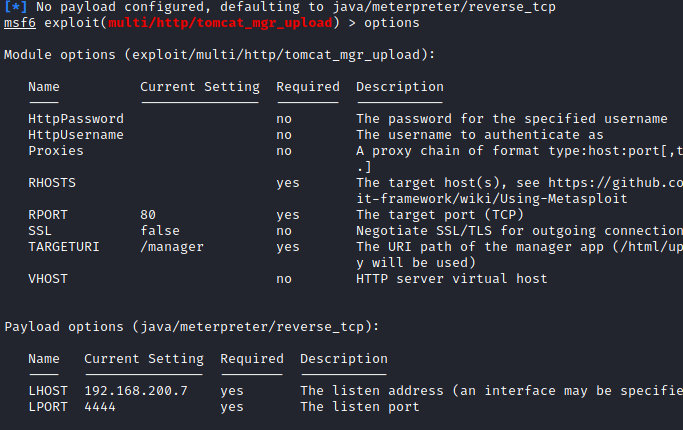

Here are the settings I made, and the shell!

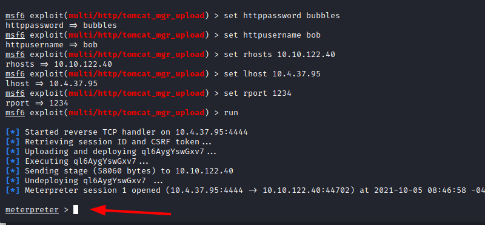

Who are we? ROOT!

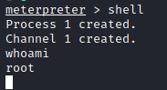

And our flag!

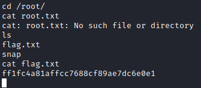