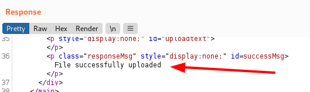
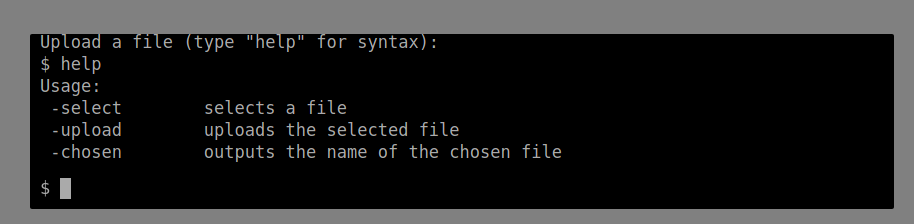
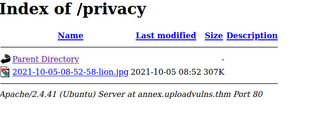

# Upload Vulnerabilities

Tutorial room exploring some basic file-upload vulnerabilities in websites.

## Overwriting Existing Files

Our goal here is to upload a file, overwriting an existing file.

Here we can see the background image location.

So I'll try my luck uploading a file called mountains.jpg and see how the server responds.

I've downloaded an image of a lion and renamed it to mountains.jpg.

Here is the upload

And that was a success!

## Remote Code Execution

Here we have a page where we can try to upload files, aiming for a reverse shell.

First I need to find out where the files are uploaded to. I can try upload the image in the previous challenge.

Trying the obvious location (upload/uploads) didn't work.

I'll try gobuster to look for possible upload locations.

We quickly found a hit, 'resources'.

Here we can see the file I uploaded.

Now for some reverse shell options... I'll assume PHP and try my luck.

Here is some PHP code to launch a potential reverse shell.

I'll open a netcat listener as well (note I had the wrong port in the screen shot below, I changed it to port 4444 afterwards).

We can see my uploaded file here:

After selecting the link I had a shell open on my netcat listener

Some quick hunting around and we have found our flag!

## Filtering

Now the remaining challenges in this room will include some filtering defences we have to navigate around. The following challenges / will include different types of filtering.

## Client Side Filtering

Client side filtering should be relatively easy to bypass, as the filtering code is run on the client's web browser. 

Here we have a site we wish to upload a reverse shell to.

Let's have a look at the source code.

A quick look and we can see the potential client side filtering script.

Following this js file we can see it only allows for png images.

I'll upload something to see where it goes.

After uploading it, nothing obvious to where it goes, I'll try some default locations like upload, assets, resources, images etc. Should this fail I'll use gobuster.

No need for gobuster this time, I found it:

Now I'll try and upload the PHP reverse shell we used previously.

No luck... so looks like I'll need to bypass the client side filtering.

So I've uploaded a valid file again and captured it in Burp so I can make modifications.

Now I'll send this over to repeater in burp and try manually modify it to send a php file.

Here is the modified POST request.

And our success response

Now to check out the site and try the reverse shell.

So far so good!

Win! I have a shell!

And for the flag:

## Server Side Filtering - File Extensions

This might be a little tougher, we need to trick the filtering code on the server now. This section filters by file extension.

So for this challenge we have an interesting looking file upload portal. A fake shell :)

Let's try a jpg file to begin with and see where it lands on the server.

So a JPG file worked ok, now I need to workout where it went. Trying the other folders I used last time didn't work.

Over to gobuster!

Privacy looks interesting.

We have a winner!

So now we know the location, I need to try and upload our reverse shell.

Using a similar process to last time, I'll re-use our Burp captured upload with a valid file, edit the request and see what we can get! First I'll try adding in two file extensions e.g. rs.jpg.php and see if that works, if not I'll try some other extensions.!

No luck

Now for additional file extensions.

PHP5 extension worked, we can see the file here:

Now for our reverse shell and flag!

And there we have it!

## Server Side Filtering - Magic Numbers

Magic numbers are a more accurate way of determining file types using a string of hex digits to determine the file type. Our lesson here advises that it is a very strong method when using a PHP server, but might be easier with other languages. 

In this challenge we have levelled up! The directory listing has been disabled, so we'll need to try and find the upload file directly rather than the folder location.

 Here is our target

I'll start as usual with a standard jpg upload. Lions again.... yes :)

GIFs only, oh dear...

I'll rename my file...

That didn't work, looks like the magic number filtering is working ;) I'll get a lion gif!

So here we are with an uploaded file, lion.gif and a valid gif file. 

Now I need to workout where it went!

I'll use ZAP because it's quick! So I tried to load site/images/lion.gif now I'll fuzz the images component of the uri.

Here is our fuzz attack

So the folder is 'graphics'!

Next I need to try and trick the server into thinking my file upload is a GIF!

Wikipedia has a nice list of magic numbers used, here is our gif file magic!

So I guess I will try add these HEX values to the PHP file I'll upload...

I've added in the GIF header 'GIF87a' into our reverse shell PHP file with VIM, now the linux 'file' command think's it's a GIF file which is a good start.

Next I'll try and upload this file...

WIN!

Now for our reverse shell...

Victory!

I'll get the flag now...

That was fun! now for the final challenge...

## Challenge

Here we have our final challenge, we have a blackbox and and upload portal.

Starting off with uploading my lion.jpg I get a file to big error! But I'd guess (due to the speed it comes back) it is a client side filter. 

So the first thing to note is that this site is not driven by php, according to wappalyzer it is a node.js site.

So we can assume that a php shell will not work here.

Looking through the source code of the site we can see a few checks happening on the client side.

Note there is an error in the code here the file type needs to have an extension of **jpg AND jpeg** so nothing will upload unless we fully bypass this javascript. 

So I used Burp to remove the javascript from loading on my page by intercepting the web request and removing the code seen above. Sorry I forgot to take a screen grab here, but the idea is to intercept the server response, delete the JS code that checks for the file type / content. 

Now I have prepared a reverse shell code for a node.js server which I got from allthingspayloads github. This has been edited accordingly.

Trying to upload it as a .JS file failed, but uploading the payload as a jpg seemed to work!

Now I need to try and find out where this uploaded. The lesson advises that it might not be the same file name we chose, so I might need to get creative with a fuzzer.

the room provides a list of 3 letter capital letters, I assume this will come in handy for the upload file name or folder name (or both!).

We got some interesting stuff from gobuster, admin and content folder in particular.

The admin folder seems to execute modules!

The content folder is not listable, I'm going to assume that this is the upload directory. But loading the 'image' I uploaded by name doesn't work. I'll try fuzzing it with the list we were provided.

Looks like I have something interesting here, fuzzing it with ZAP and we have FKJ as a potential file we uploaded.

We're on the right track here, the file contains errors as it is being loaded as an image....

Meaning we have found our uploaded JS file!

Now to try and reverse shell it, using the admin page that runs modules.

So we get an error when running the FKJ.jpg in the admin page - the file doesn't exist, perhaps I can try a relative path!

I'll try ../content/FKJ.jpg

Bingo!

Our netcat listener got a hit, running the relative path from the admin page has worked.

Now for the flag!

Presto!

That's it for this room. :)