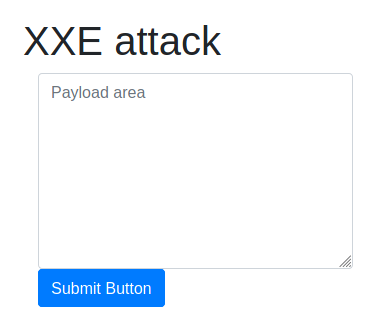
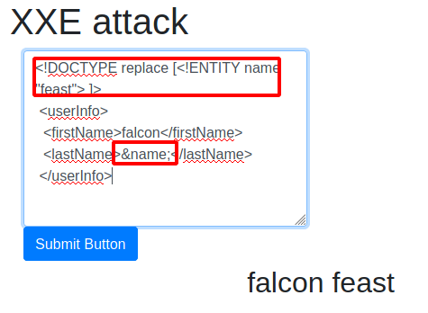
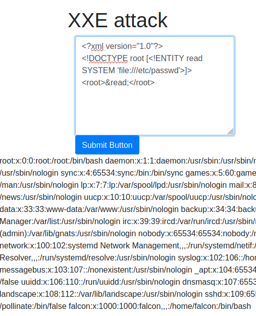
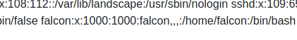
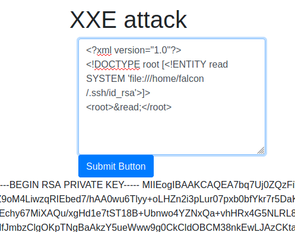

# XXE Room

This room aims at providing the basic introduction to XML External entity(XXE) vulnerability.

In this lesson we're given an XXE payload field to work with some XML.

Using a simple payload we can use an entity and assign it a value 'feast'.

We can use such a variable to call a system file, below as an example we call the /etc/passwd file.

So here we can see the user accounts on the server, the one we're interested in is falcon

Now we could try to read their ssh key to obtain access to their system.

Knowing their username and home folder we could try and read /home/falcon/.ssh/id_rsa which is the default ssh id.

And here we have it!

We could now attempt to login with that ssh id.

That's it for this lesson.