# ZTH: Web 2

A room more focused on the misconfiguration of web servers, rather than sheer exploits

The purpose of this room, is to show the more subtle vulnerabilities. These vulns won't get you RCE, or LFI, but they will allow you to access sensitive information that a client would want to keep protected.

The topics that will be covered in this room are:

\- IDOR

\- Forced Browsing

\- API based Authentication Bypass

## IDOR: Insecure Direct Object Reference

Here we have to exploit IDOR to obtain a flag.

We have been provided a login to a note taking based web site, after logging in we can see the note number referenced in the URL

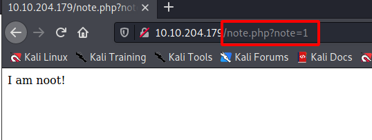

We can try exploit this by simply changing the note number in the url path.

I'll use ZAP to try several note numbers very quickly.

Here I am using the fuzzer to try note numbers 0 through to 100

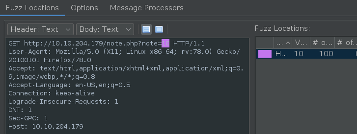

We have the flag! item 0 worked with the flag given in the response.

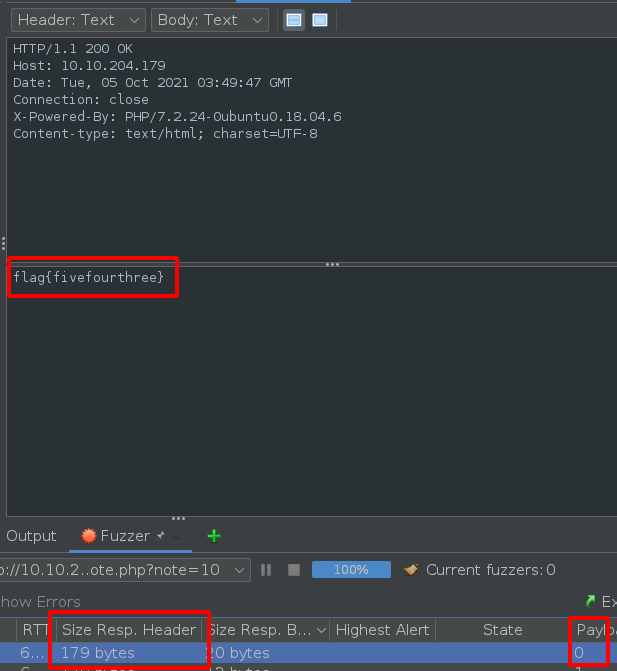

## Forced Browsing

Similar to IDOR we try and browse to logically likely url paths.

In this section they introduced a tool called wfuzz which is similar to dirbuster but provides more control over the path.

The example provide is example.com/user1/note.txt here we could fuzz the user1 component of the path to try and find other user accounts' notes.

Here is a target site as explained above

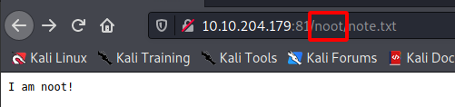

Here I've started a fuzz, we can see a word of 57 when we receive a 404, so I'll exclude these results.

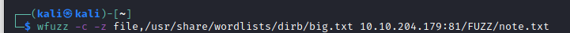

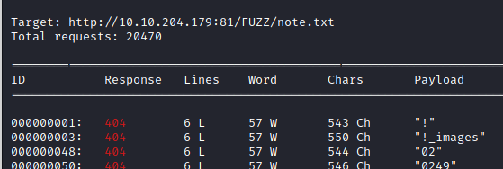

Here is the next run, hiding responses with a word count of 57:

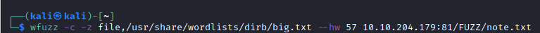

Here we have a hit!

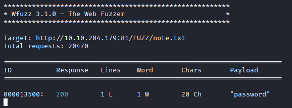

And the flag is...

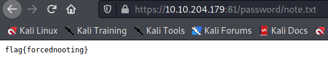

## API Bypass

This is a generic kind of exploit, taking advantage of misconfigurations on a site. E.g. Maybe bypassing a login if we know the URL path to the resource we want to access.

In this example we are asked to find a flag in a file flag.txt

Here we have logged in with provided details and can access a command field.

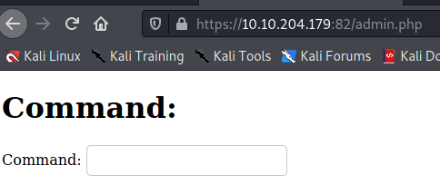

Typing in a command we can see the path used

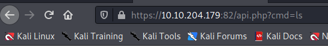

there is an API.php file that looks interesting, this command didn't yield any results thought I'll try some others.

After a few attempts - no results returned, the tutorial talks about having different parameters that we might need to discover. I'll use a similar method as the previous challenge to fuzz parameters on this api.php file.

Here I've setup ZAP fuzzer to fuzzer the parameter in the url path. I've used a word list big.txt from dirbuster.

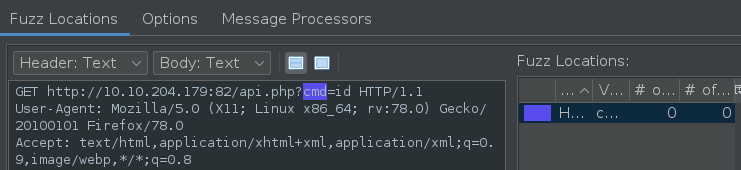

doing a few fuzzes didn't yield much, so I started trying the target flag.txt in different locations. Turns out it's directly accessible from the root path. Here we have it

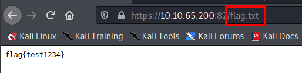

That's all for this lesson.